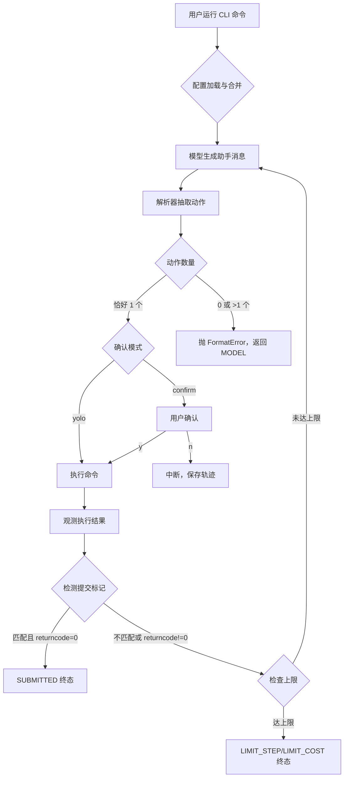

# 产品需求文档 (PRD) v2.0

**项目名称**: mini SWE Agent
**功能名称**: 自动化 Shell 执行闭环 CLI 工具
**文档状态**: 草稿 (Draft)
**版本号**: 1.1
**负责人**: Genesis Agent
**创建日期**: 2026-05-10
**最后更新**: 2026-05-10 (Challenge Round 1 修复)

---

## 1. 执行摘要 (Executive Summary)

面向开发者与研究者的 CLI 工具，实现模型 → 解析动作 → 执行 → 观测的闭环，支持严格动作协议、完整轨迹记录与批量评估。

---

## 2. 背景与上下文 (Background & Context)

### 2.1 问题陈述 (Problem Statement)
- **当前痛点**: 研究者需要一个可复现的自动化编程任务执行框架。现有的 agent 实现要么行为不可预测（静默选择动作），要么缺少轨迹记录（无法分析失败原因），要么不支持批量评估（无法做 benchmark）。
- **影响范围**: AI 编程研究者、自动化工具开发者
- **业务影响**: 无法系统化评估模型在真实编程任务中的表现

### 2.2 核心机会 (Opportunity)
提供标准化的执行框架，支持严格动作协议、多环境后端、完整轨迹记录，为 SWE benchmark 和研究提供可复现的基础设施。

---

## 3. 目标与范围 (Goals & Non-Goals)

### 3.1 目标 (Goals)
- **[G1]**: 实现严格的状态机闭环（MODEL → PARSE → EXECUTE → OBSERVE），确保每步可审计
- **[G2]**: 支持本机 subprocess 执行，含超时、returncode、stdout、stderr、异常元数据
- **[G3]**: 提供完整轨迹 JSON 记录，包含消息历史、工具调用关联、成本与步数统计
- **[G4]**: 支持批量评估模式，生成符合 schema 的 preds.json，支持并发与重跑
- **[G5]**: 提供 Textual TUI 检查器，可视化审查轨迹并高亮异常步骤

### 3.2 非目标 (Non-Goals)
- **[NG1]**: 规定仓库目录结构、内部包名、端口等实现细节
- **[NG2]**: 提供 Web UI 或远程执行服务（仅 CLI）
- **[NG3]**: 实现复杂的任务依赖编排（单任务闭环 + 批处理简单并行）
- **[NG4]**: 支持轨迹编辑或回滚重新执行（仅查看）

---

## 4. 用户故事与需求清单 (User Stories)

### US-001: 核心状态机闭环 [REQ-001] (优先级: P0)

*   **故事描述**: 作为一个研究者，我想要 agent 能执行 MODEL → PARSE → EXECUTE → OBSERVE 的闭环，以便于自动化完成编程任务
*   **用户价值**: 提供可预测、可审计的自动化执行框架
*   **独立可测性**: 运行简单任务（如 `echo hello`），验证完整闭环执行
*   **涉及系统**: `core-agent`
*   **验收标准 (Acceptance Criteria)**:
    *   [ ] **Given** 初始状态为 MODEL，**When** 模型生成助手消息，**Then** 进入 PARSE 状态
    *   [ ] **Given** PARSE 状态且解析到恰好一个动作，**When** 确认模式为 yolo 或用户确认，**Then** 进入 EXECUTE 状态
    *   [ ] **Given** EXECUTE 状态，**When** 命令执行完成，**Then** 进入 OBSERVE 状态捕获结果
    *   [ ] **Given** OBSERVE 状态，**When** 结果已追加到消息历史，**Then** 检查步数/成本上限，未达上限则返回 MODEL
    *   [ ] **异常处理**: 当解析到 0 或 >1 动作时，向模型抛 FormatError，该步不执行任何 Shell
*   **边界与极限情况**:
    *   [边界条件1] 达到步数上限时进入 LIMIT_STEP 终态（步数定义：每次命令执行完成（进入 OBSERVE 状态）后增加 1，无论 returncode 值；FormatError / CommandValidationError / 超时异常时不增加）
    *   [边界条件2] 达到成本上限时进入 LIMIT_COST 终态
    *   [边界条件3] 用户中断时尽力保存轨迹 JSON 并进入 INTERRUPT 终态
    *   [边界条件4] 配置加载失败时进入 FATAL_CONFIG 终态（CLI 层保存最小化诊断文件）
    *   [边界条件5] 连续 FormatError >= 5 次时进入 UNKNOWN_ERROR 终态（防止无限循环）

### US-002: 严格动作协议 [REQ-002] (优先级: P0)

*   **故事描述**: 作为一个研究者，我想要解析器严格遵守"恰好一个动作"的协议，以便于可预测的行为和格式错误检测
*   **用户价值**: 确保行为可预测，避免静默选择导致的不确定性
*   **独立可测性**: 提供各种格式错误的助手输出，验证均抛 FormatError
*   **涉及系统**: `core-agent`
*   **验收标准 (Acceptance Criteria)**:
    *   [ ] **Given** Tool-call 模式，**When** 响应包含恰好一次 bash 工具调用，**Then** 提取命令字符串
    *   [ ] **Given** Tool-call 模式，**When** 响应包含 0 或 >1 次工具调用，**Then** 抛 FormatError
    *   [ ] **Given** 文本模式，**When** 输出包含恰好一个围栏块或 XML 块，**Then** 提取命令字符串
    *   [ ] **Given** 文本模式，**When** 输出包含 0 或 >1 块，或 tool-call 与文本同时命中，**Then** 抛 FormatError
    *   [ ] **异常处理**: FormatError 时该步不执行任何 Shell，向模型提供结构化反馈
*   **边界与极限情况**:
    *   [边界条件1] 围栏块和 XML 块同时命中时抛 FormatError
    *   [边界条件2] 命令字符串为空时抛 FormatError

### US-003: 本机执行 [REQ-003] (优先级: P0)

*   **故事描述**: 作为一个开发者，我想要使用本机 subprocess 执行 Shell 命令，以便于可靠的命令执行基础
*   **用户价值**: 提供可靠的命令执行基础，支持超时控制和错误捕获
*   **独立可测性**: 执行简单命令（如 `echo hello`），验证捕获完整的 returncode/stdout/stderr
*   **涉及系统**: `core-agent`
*   **验收标准 (Acceptance Criteria)**:
    *   [ ] **Given** Shell 命令，**When** 执行，**Then** 使用本机 subprocess 并捕获 returncode/stdout/stderr
    *   [ ] **Given** 命令执行超时，**When** 超时时间到，**Then** 终止进程并记录超时错误
    *   [ ] **Given** 命令执行异常，**When** 发生，**Then** 捕获异常元数据
    *   [ ] **异常处理**: 执行超时时直接终止该步并记录错误，不重试
*   **边界与极限情况**:
    *   [边界条件1] 超时设置（默认 120 秒，可配置）
    *   [边界条件2] 空命令或命令字符串为空时抛出错误

### US-004: 提交标记契约 [REQ-004] (优先级: P0)

*   **故事描述**: 作为一个研究者，我想要通过明确的提交标记判断任务完成，以便于标准化评估
*   **用户价值**: 提供可测试、可复现的任务完成判断标准
*   **独立可测性**: 运行任务并输出标记，验证进入 SUBMITTED 状态
*   **涉及系统**: `core-agent`
*   **验收标准 (Acceptance Criteria)**:
    *   [ ] **Given** OVERALL_OUTPUT.lstrip() 后首行恰为 COMPLETE_TASK_AND_SUBMIT_FINAL_OUTPUT，**When** returncode == 0，**Then** 进入 SUBMITTED 状态
    *   [ ] **Given** SUBMITTED 状态，**When** 首行之后余下内容，**Then** 为最终提交正文
    *   [ ] **Given** 出现标记文本但 returncode != 0，**When** 检测，**Then** 不得提交
    *   [ ] **异常处理**: returncode != 0 时即使出现标记也不提交
*   **边界与极限情况**:
    *   [边界条件1] 标记必须独立成行（首行 lstrip 后匹配）
    *   [边界条件2] 标记大小写敏感

### US-005: 模型适配 [REQ-005] (优先级: P0)

*   **故事描述**: 作为一个开发者，我想要同时支持 tool-call 与文本协议，以便于兼容不同模型 API
*   **用户价值**: 支持多种模型接口，提高工具通用性
*   **独立可测性**: 分别配置 tool-call 和文本模式，验证解析正确
*   **涉及系统**: `core-agent`
*   **验收标准 (Acceptance Criteria)**:
    *   [ ] **Given** Tool-call 模式，**When** API 返回工具调用，**Then** 解析器提取 bash 命令
    *   [ ] **Given** 文本模式，**When** API 返回纯文本，**Then** 解析器提取围栏/XML 块
    *   [ ] **Given** API 返回无状态 response/output_items，**When** 下一轮调用，**Then** 扁平化为对话消息
    *   [ ] **Given** 每次调用，**When** 完成，**Then** 计费 cost（可为 0）并累加
    *   [ ] **异常处理**: 响应缺 cost 时可配置忽略或报错（文档化默认策略）
*   **边界与极限情况**:
    *   [边界条件1] 网络超时/API 错误重试 5 次
    *   [边界条件2] 不得把 FormatError 当成功重试
    *   [边界条件3] 成本计费：使用 API 返回的原始 cost（如有），否则基于 tokens 计算 [ASSUMPTION]

### US-006: 轨迹记录 [REQ-006] (优先级: P0)

*   **故事描述**: 作为一个研究者，我想要完整记录对话历史与执行元数据，以便于事后分析和批评
*   **用户价值**: 提供可复现、可审计的执行记录
*   **独立可测性**: 运行任务后检查轨迹 JSON，验证包含完整消息历史和工具调用关联
*   **涉及系统**: `core-agent`
*   **验收标准 (Acceptance Criteria)**:
    *   [ ] **Given** 任务执行，**When** 每步完成，**Then** 追加消息到轨迹（含 role/content/timestamp）
    *   [ ] **Given** Tool-call 模式，**When** 工具执行完成，**Then** 观测结果与 tool_call_id 关联
    *   [ ] **Given** 任务结束，**When** 保存轨迹，**Then** JSON 包含 messages、timestamps、cost_accumulator、step_counter
    *   [ ] **异常处理**: 中断时尽力保存轨迹 JSON
*   **边界与极限情况**:
    *   [边界条件1] 轨迹 JSON 嵌入 schema version 字段（当前版本 v1）[ASSUMPTION]
    *   [边界条件2] 读取轨迹时做兼容性检查，不兼容时抛出明确错误 [ASSUMPTION]

### US-007: 配置管理 [REQ-007] (优先级: P1)

*   **故事描述**: 作为一个开发者，我想要通过 YAML + Jinja2 多源合并配置，以便于灵活的环境适配
*   **用户价值**: 支持多环境配置复用，减少重复配置
*   **独立可测性**: 创建 base.yaml 和 local.yaml，验证合并后配置正确
*   **涉及系统**: `config`
*   **验收标准 (Acceptance Criteria)**:
    *   [ ] **Given** 多个配置源，**When** 合并，**Then** 遵循优先级：CLI > 文件 > key=value [ASSUMPTION]
    *   [ ] **Given** 配置文件，**When** 包含 Jinja2 模板，**Then** 使用 StrictUndefined 渲染
    *   [ ] **Given** 观测模板渲染后，**When** output 长度 >= 10000，**Then** warning + 前 5000 + 后 5000 + elided_chars
    *   [ ] **异常处理**: 模板变量未定义时抛 StrictUndefined 错误
*   **边界与极限情况**:
    *   [边界条件1] 递归合并策略（文档化）
    *   [边界条件2] 禁止硬编码密钥，仅允许环境变量与配置文件

### US-008: 批处理模式 [REQ-008] (优先级: P1)

*   **故事描述**: 作为一个研究者，我想要批量运行多个任务并生成 preds.json，以便于大规模评估
*   **用户价值**: 支持大规模 benchmark 评估，提高研究效率
*   **独立可测性**: 运行 3 个示例任务，验证生成符合 schema 的 preds.json
*   **涉及系统**: `cli`, `core-agent`
*   **验收标准 (Acceptance Criteria)**:
    *   [ ] **Given** 批处理模式，**When** 运行多个任务，**Then** 生成 preds.json（key 为 instance_id）
    *   [ ] **Given** preds.json，**When** 每个 value，**Then** 至少包含 instance_id、model_name_or_path、model_patch
    *   [ ] **Given** 批处理，**When** 配置 workers > 1，**Then** 使用进程池并发执行 [ASSUMPTION]
    *   [ ] **Given** 某任务失败，**When** 其他任务运行中，**Then** 失败不影响其他任务 [ASSUMPTION]
    *   [ ] **异常处理**: 按 instance 记录错误到 preds.json 或单独错误文件
*   **边界与极限情况**:
    *   [边界条件1] 支持 regex 过滤、切片、确定性 shuffle（文档化 seed 与顺序）
    *   [边界条件2] 支持 redo_existing 重跑失败项 [ASSUMPTION]

### US-009: Textual 检查器 [REQ-009] (优先级: P1)

*   **故事描述**: 作为一个研究者，我想要通过 TUI 可视化审查轨迹 JSON，以便于人工质量检查
*   **用户价值**: 提供直观的轨迹审查界面，快速定位问题步骤
*   **独立可测性**: 加载轨迹 JSON，验证可按步骤浏览并高亮 FormatError 步骤
*   **涉及系统**: `cli`
*   **验收标准 (Acceptance Criteria)**:
    *   [ ] **Given** 轨迹 JSON 文件，**When** 启动检查器，**Then** 显示消息数组或 { "messages": [...] }
    *   [ ] **Given** 步骤浏览，**When** 到达 FormatError 步骤，**Then** 高亮显示异常
    *   [ ] **Given** 轨迹包含 ANSI 转义序列，**When** 显示，**Then** 正确渲染
    *   [ ] **Given** 轨迹包含 NUL 字符，**When** 显示，**Then** 鲁棒处理
    *   [ ] **异常处理**: 不支持的格式时给出明确错误提示
*   **边界与极限情况**:
    *   [边界条件1] 按步聚合（助手轮次 / extra.actions 等实现方约定）
    *   [边界条件2] 仅支持只读查看，不支持编辑或回滚 [ASSUMPTION]

### US-010: CLI 主命令 [REQ-010] (优先级: P0)

*   **故事描述**: 作为一个开发者，我想要通过 CLI 单命令运行任务，以便于快速集成到脚本
*   **用户价值**: 简单易用的命令行接口，支持核心参数配置
*   **独立可测性**: 运行 `--help` 验证参数列表和风险警示
*   **涉及系统**: `cli`
*   **验收标准 (Acceptance Criteria)**:
    *   [ ] **Given** CLI 主命令，**When** 执行，**Then** 至少包含 model、model 类、environment 类、agent 类、--task、--config（可重复）、--yolo、--exit-immediately、--output、--cost-limit、--step-limit
    *   [ ] **Given** --help，**When** 显示，**Then** 明确写出"会执行 Shell"的风险
    *   [ ] **Given** --yolo，**When** 设置，**Then** 跳过确认步骤自动执行
    *   [ ] **异常处理**: 参数缺失或格式错误时给出明确错误提示
*   **边界与极限情况**:
    *   [边界条件1] 步数上限设置方式必须文档化
    *   [边界条件2] 支持打印合并后配置（扩展能力）

---

## 5. 用户体验与设计 (User Experience) — 可选

### 5.1 关键用户旅程 (Key User Flows)

### 5.2 交互规范 (Design Guidelines)
- **视觉风格**: CLI 遵循 Unix 哲学，简洁明确，输出格式化
- **响应模式**: 执行中显示进度，错误时提供结构化反馈
- **平台兼容**: 跨平台（Linux/macOS/Windows WSL）

---

## 6. 约束与限制 (Constraint Analysis)

### 6.1 技术约束 (Technical Constraints)
*   **遗留系统**: 无（新项目）
*   **性能底线**: 单步执行超时默认 120 秒（可配置）
*   **扩展性预期**: 批处理支持多进程并发（workers 可配置）

### 6.2 安全与合规 (Security & Compliance)
*   **数据安全**: 日志中绝对不可包含明文密钥，仅允许环境变量与配置文件
*   **网络要求**: Local 模式不限制网络，沙箱模式按后端规则
*   **合规审核**: 用户可见警示（CLI --help + README）：执行模型生成的 Shell 可能改文件、外泄数据、使用网络

### 6.3 时间与资源 (Time & Resources)
*   **交付死线**: 无（研究工具）
*   **其他限制**: 依赖模型 API 的可用性和速率限制

---

## 7. 成功指标 (Success Metrics) — 可选

| 核心指标 (Metric) | 目标值 (Target) | 测量方式 (Measurement Method) |
| ----------------- | --------------- | ----------------------------- |
| 功能: 解析协议准确率 | 100% | 单元测试覆盖所有边界场景 |
| 功能: 提交契约准确率 | 100% | 单元测试覆盖成功/失败路径 |
| 性能: 批处理并发效率 | 线性加速比 | 多 workers 性能测试 |

---

## 8. 完成标准 (Definition of Done)

*   [ ] 所有的验收标准 (AC) 全部测试通过。
*   [ ] 包含足够的自动化单元测试（解析、提交、模板截断、轨迹 schema）。
*   [ ] 集成测试覆盖核心闭环（成功路径 + FormatError + 提交失败）。
*   [ ] 代码 Lint 及格式化审查均无警告。
*   [ ] 已更新 README（包含风险警示、环境变量说明、示例）。
*   [ ] 真机/火测默认关闭，单一环境变量名在 README 中启用。
*   [ ] 拒绝规则已文档化并测试（禁止静默选择、禁止 returncode!=0 时提交）。

---

## 9. 附录 (Appendix) — 可选

### 9.1 术语表 (Glossary)
- **FormatError**: 解析器检测到动作格式错误（0 动作、>1 动作、tool+文本冲突等）
- **COMPLETE_TASK_AND_SUBMIT_FINAL_OUTPUT**: 提交标记契约的触发字符串
- **yolo**: 自动执行模式，跳过每步人工确认
- **confirm**: 每步执行前人工确认模式
- **trajectory**: 轨迹 JSON，记录完整对话历史与执行元数据
- **preds.json**: 批处理输出文件，包含 instance_id、model_name_or_path、model_patch

### 9.2 参考资料 (References)
- 无

---

<!-- CRITICAL 使用指南 -->
<!--
**PRD 撰写原则 (精益规格要求)**:
1. **去冗存精**: 抵制长篇大论，整个文档建议控制在阅读时间 10 分钟以内。
2. **执行摘要 < 50字**: 用最少的话讲明白核心价值。
3. **独立性**: User Story 粒度必须控制在"可单独交付验证"的级别。
4. **追溯链 (Traceability)**: [REQ-XXX] 编号是神圣不可侵犯的，将贯穿架构、任务和代码。

**章节使用指南**:
- **必需章节**: 1, 2.1, 3, 4, 6, 8
- **可选章节**: 2.3 (竞品分析), 5 (UX设计), 7 (成功指标), 9 (附录)
- **小型功能/迭代**: 可大胆删除 2.3, 5, 7, 9，保留骨架即可。
-->
