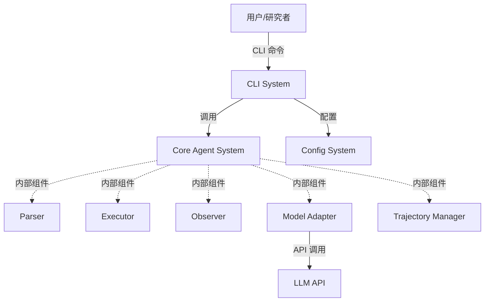
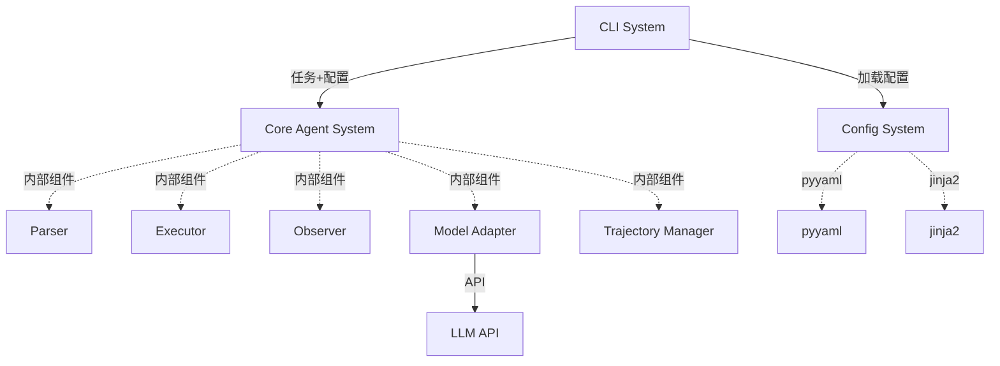
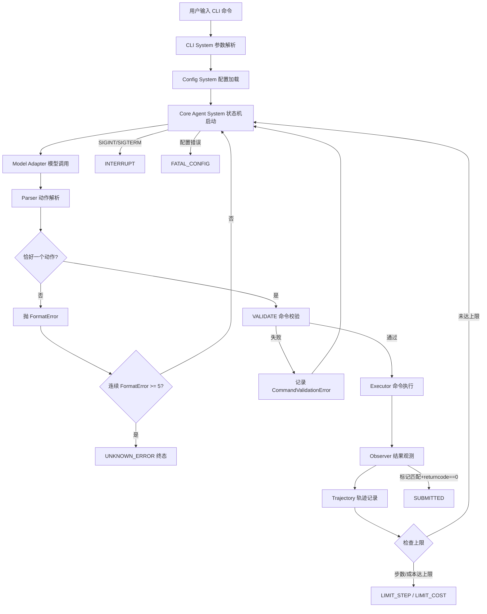

# 系统架构总览 (Architecture Overview)

**项目**: mini SWE Agent
**版本**: 1.0
**日期**: 2026-05-10

---

## 1. 系统上下文 (System Context)

### 1.1 C4 Level 1 - 系统上下文图



### 1.2 关键用户 (Key Users)
- **研究者**: 使用 CLI 工具进行自动化编程任务评估
- **开发者**: 集成 CLI 工具到脚本和工作流

### 1.3 外部系统 (External Systems)
- **LLM API**: OpenAI / Anthropic / 其他模型（通过 litellm）

---

## 2. 系统清单 (System Inventory)

### System 1: Core Agent System
**系统ID**: `core-agent`

**职责 (Responsibility)**:
- 核心状态机（MODEL → PARSE → EXECUTE → OBSERVE）
- 协调内部组件
- 终态处理（SUBMITTED, LIMIT_STEP, LIMIT_COST, INTERRUPT, FATAL_CONFIG）

**内部组件**:
- Parser（动作解析）
- Executor（subprocess 执行）
- Observer（结果观测）
- Model Adapter（模型 API 适配）
- Trajectory Manager（轨迹记录）

**边界 (Boundary)**:
- **输入**: 任务描述、配置
- **输出**: 执行结果、轨迹
- **依赖**: config-system

**关联需求**: [REQ-001] 核心状态机闭环, [REQ-002] 严格动作协议, [REQ-003] 本机执行, [REQ-004] 提交标记契约, [REQ-005] 模型适配, [REQ-006] 轨迹记录

**技术栈**:
- Language: Python 3.10+
- Libraries: subprocess, litellm, tenacity

**设计文档**: `04_SYSTEM_DESIGN/core-agent.md` (待创建)

---

### System 2: CLI System
**系统ID**: `cli-system`

**职责 (Responsibility)**:
- CLI 入口，参数解析
- 命令分发（单任务 / 批处理 / 检查器）
- 风险警示（--help）

**扩展能力**:
- **批处理模式**：批量运行多个任务，生成 preds.json
  - 支持 multiprocessing 并发
  - 支持 regex 过滤、切片、确定性 shuffle
  - 支持 redo_existing 重跑失败项
- **Textual 检查器**：可视化审查轨迹 JSON
  - 按步聚合
  - 高亮显示异常步骤（如 FormatError）
  - 对 ANSI、NUL 鲁棒处理

**边界 (Boundary)**:
- **输入**: 用户命令行参数
- **输出**: 命令分发到相应系统
- **依赖**: config-system, core-agent

**关联需求**: [REQ-010] CLI 主命令, [REQ-008] 批处理模式, [REQ-009] Textual 检查器

**技术栈**:
- Framework: click
- Language: Python 3.10+
- Libraries: textual, multiprocessing

**设计文档**: ADR 足够（无需单独设计文档）

---

### System 3: Config System
**系统ID**: `config`

**职责 (Responsibility)**:
- YAML + Jinja2 配置管理
- 多源配置递归合并
- 观测模板渲染与截断

**边界 (Boundary)**:
- **输入**: 多源配置（CLI / 文件 / 环境变量 / 默认值）
- **输出**: 合并后配置
- **依赖**: pyyaml, jinja2

**关联需求**: [REQ-007] 配置管理

**技术栈**:
- Language: Python 3.10+
- Libraries: pyyaml, jinja2

**设计文档**: `04_SYSTEM_DESIGN/config.md` (待创建)

---

## 3. 系统边界矩阵 (System Boundary Matrix)

| 系统 | 输入 | 输出 | 依赖系统 | 被依赖系统 | 关联需求 |
|------|------|------|---------|----------|---------|
| Core Agent System | 任务描述、配置 | 执行结果、轨迹 | - | CLI System | [REQ-001], [REQ-002], [REQ-003], [REQ-004], [REQ-005], [REQ-006] |
| CLI System | 命令行参数 | 命令分发 | Config System, Core Agent System | - | [REQ-010], [REQ-008], [REQ-009] |
| Config System | 多源配置 | 合并后配置 | pyyaml, jinja2 (外部) | CLI System | [REQ-007] |

---

## 4. 系统依赖图 (System Dependency Graph)



---

## 5. 项目结构 (Project Structure)

```text
mini-swe-agent/
├── src/
│   ├── cli/                 # CLI System
│   │   ├── __init__.py
│   │   ├── main.py          # 主命令入口
│   │   ├── batch.py         # 批处理扩展
│   │   └── checker.py       # Textual 检查器扩展
│   ├── core/                # Core Agent System
│   │   ├── __init__.py
│   │   ├── agent.py         # 核心状态机
│   │   ├── state_machine.py # 状态机实现
│   │   ├── parser.py        # 动作解析（内部组件）
│   │   ├── executor.py      # subprocess 执行（内部组件）
│   │   ├── observer.py      # 结果观测（内部组件）
│   │   ├── model.py         # 模型适配（内部组件）
│   │   └── trajectory.py    # 轨迹记录（内部组件）
│   └── config/              # Config System
│       ├── __init__.py
│       └── config_manager.py
├── tests/
│   ├── unit/
│   ├── integration/
│   └── e2e/
├── pyproject.toml
├── README.md
└── .anws/
    └── v1/
```

---

## 6. 数据流 (Data Flow)

