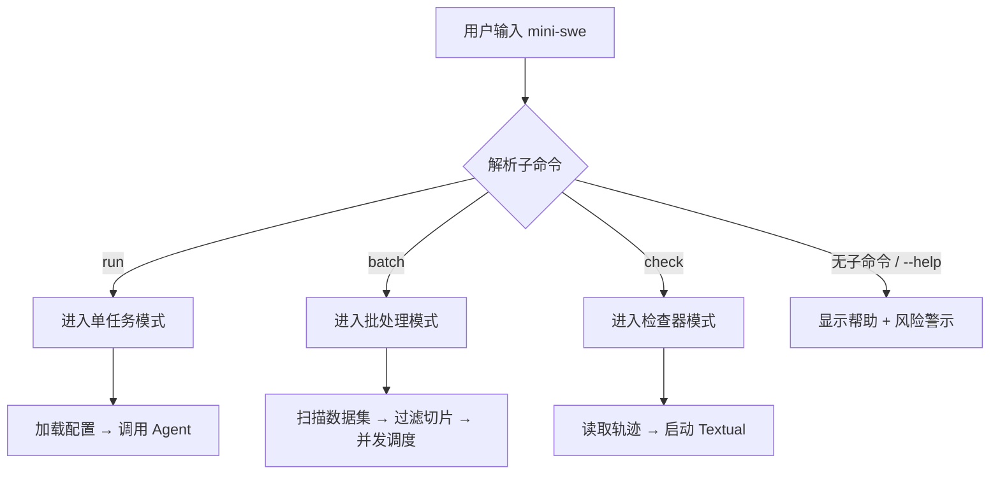

# CLI System — 实现细节 (L1)

> **文件性质**: L1 实现层 · **对应 L0**: [`cli-system.md`](./cli-system.md)
> 本文件仅在 `/forge` 任务明确引用时加载。日常阅读和任务规划请优先看 L0。
> **孤岛检查**: 本文件各节均须在 L0 有对应超链接入口，禁止孤岛内容。

---

## 版本历史

> 所有变更记录集中于此，不再散落在代码注释里。

| 版本 | 日期       | Changelog |
| ---- | ---------- | --------- |
| v1.0 | 2026-05-10 | 初始版本  |
| v1.1 | 2026-05-10 | Challenge Round 1 P0 修复：H6(CLI配置覆盖)、H7(preds.json字段)、C2(终态映射) |

---

## 本文件章节索引

|   §   | 章节                                                                 |   对应 L0 入口   |
| :---: | -------------------------------------------------------------------- | :--------------: |
|  §1   | [配置常量](#1-配置常量-config-constants)                             |  L0 §6 数据模型  |
|  §2   | [完整数据结构](#2-核心数据结构完整定义-full-data-structures)         |  L0 §6 数据模型  |
|  §3   | [核心算法伪代码](#3-核心算法伪代码-non-trivial-algorithm-pseudocode) | L0 §5 操作契约表 |
|  §4   | [决策树详细逻辑](#4-决策树详细逻辑-decision-tree-details)            |   L0 §4 架构图   |
|  §5   | [边缘情况与注意事项](#5-边缘情况与注意事项-edge-cases--gotchas)      |    L0 §5 / §9    |
|  §6   | [测试辅助](#6-测试辅助-test-helpers) *(可选)*                        | L0 §11 测试策略  |

---

## §1 配置常量 (Config Constants)

> 所有硬编码配置、枚举映射、查找表集中放在此处。
> **L0 对应入口**: L0 §6 末尾锚点 → *配置常量字典详见 [L1 §1]*

```python
# ── CLI 默认配置 ──
CLI_DEFAULTS = {
    "output_dir": Path("./outputs"),
    "preds_output": Path("./preds.json"),
    "default_workers": os.cpu_count() or 1,
    "max_workers_cap": 64,           # 防止误输入过大值
    "risk_banner_lines": [
        "⚠️  Warning: This tool executes shell commands automatically.",
        "    Review the task description and configuration before running.",
        "    Use --yolo with caution.",
    ],
}

# ── 批处理配置 ──
BATCH_CONFIG = {
    "instance_file_name": "instance.jsonl",  # 数据集元数据文件
    "trajectory_suffix": "_trajectory.json",   # 单任务轨迹文件后缀
    "shuffle_algorithm": "random.Random(seed).shuffle",  # 确定性 shuffle
    "schema_version": "v1",                    # preds.json schema 版本
}

# ── 检查器渲染配置 ──
CHECKER_CONFIG = {
    "max_ansi_strip": True,          # 是否剥离 ANSI 转义序列
    "nul_replacement": "␀",          # NUL 字符替换显示符
    "error_highlight_style": "bold reverse red",
    "step_table_columns": ["Step", "Action", "Status", "Cost"],
}

# ── 退出码映射 ──
# 注：CLI 层退出码与 Core Agent 终态 returncode 语义不同。
# Core Agent returncode: 0=SUBMITTED, 2=LIMIT_STEP, 3=LIMIT_COST, 4=INTERRUPT, 5=FATAL_CONFIG, 6=UNKNOWN_ERROR
EXIT_CODES = {
    "SUCCESS": 0,                    # 所有任务 SUBMITTED
    "CLI_ERROR": 2,                  # click 默认 BadParameter
    "AGENT_LIMIT_STEP": 10,          # Core Agent 达到步数上限（非失败）
    "AGENT_LIMIT_COST": 11,          # Core Agent 达到成本上限（非失败）
    "AGENT_INTERRUPT": 12,           # 用户中断
    "AGENT_FATAL_CONFIG": 13,      # Core Agent 配置错误
    "AGENT_UNKNOWN_ERROR": 14,       # Core Agent 未预期异常
    "BATCH_PARTIAL_FAILURE": 20,     # 部分任务失败（仍有 preds.json）
    "USER_DECLINED": 21,             # 用户选择不继续（yolo=False 时拒绝）
    "INTERRUPTED": 130,              # Ctrl-C (SIGINT)
}
```

---

## §2 核心数据结构完整定义 (Full Data Structures)

> 含方法体的完整类定义。L0 层只放属性声明和方法签名。
> **L0 对应入口**: L0 §6.1 末尾锚点 → *完整方法实现详见 [L1 §2]*

```python
from __future__ import annotations
from dataclasses import dataclass, field
from pathlib import Path
from typing import Protocol


@dataclass
class BatchConfig:
    dataset_path: Path
    global_config_path: Path
    workers: int = field(default_factory=lambda: os.cpu_count() or 1)
    filter_regex: str | None = None
    slice_range: tuple[int, int] | None = None
    shuffle_seed: int | None = None
    redo_existing: bool = False
    output_path: Path = field(default=Path("./preds.json"))

    def __post_init__(self) -> None:
        """校验并规范化配置"""
        if self.workers < 1:
            raise ValueError(f"workers must be >= 1, got {self.workers}")
        if self.workers > CLI_DEFAULTS["max_workers_cap"]:
            import warnings
            warnings.warn(
                f"workers capped from {self.workers} to {CLI_DEFAULTS['max_workers_cap']}"
            )
            self.workers = CLI_DEFAULTS["max_workers_cap"]

        self.dataset_path = self.dataset_path.resolve()
        self.output_path = self.output_path.resolve()

        if self.slice_range is not None:
            start, stop = self.slice_range
            if start < 0 or stop < 0:
                raise ValueError("slice_range must be non-negative")
            if start >= stop:
                raise ValueError("slice_range start must be < stop")


@dataclass
class PredEntry:
    instance_id: str
    model_name_or_path: str        # SWE-bench schema 要求字段
    model_patch: str | None = None
    test_result: str | None = None

    def to_dict(self) -> dict:
        """序列化为 preds.json 中的条目（符合 SWE-bench schema）"""
        return {
            "instance_id": self.instance_id,
            "model_name_or_path": self.model_name_or_path,
            "model_patch": self.model_patch or "",
        }


@dataclass
class BatchResult:
    total: int = 0
    completed: int = 0
    failed: int = 0
    skipped: int = 0
    preds: list[PredEntry] = field(default_factory=list)
    output_path: Path = field(default=Path("./preds.json"))

    def merge(self, other: BatchResult) -> None:
        """合并另一个 BatchResult（用于多进程结果聚合）"""
        self.total += other.total
        self.completed += other.completed
        self.failed += other.failed
        self.skipped += other.skipped
        self.preds.extend(other.preds)


class AgentRunner(Protocol):
    """CLI System 对 Core Agent System 的调用协议"""

    def run_task(
        self,
        task_description: str,
        config: dict,
        output_dir: Path | None = None,
    ) -> AgentResult:
        ...


@dataclass
class AgentResult:
    trajectory_path: Path
    final_state: str
    overall_output: str | None
    returncode: int
    model_name: str = ""  # 用于 preds.json 的 model_name_or_path
```

---

## §3 核心算法伪代码 (Non-Trivial Algorithm Pseudocode)

> **准入门槛**: 函数体估计 > 15 行 / 含不明显业务规则 / 多步骤副作用链

### §3.1 `run()` — 单任务入口

**对应契约**: L0 §5.1 — `run(config_path, overrides)`
**准入理由**: 含多步骤副作用链（配置加载 → Agent 调用 → 轨迹确认）

```python
def run(
    config_path: Path,
    model: str | None,
    yolo: bool,
    output_dir: Path,
    verbose: bool,
) -> int:
    """
    单任务 CLI 入口。

    前置条件:
    1. config_path 存在且可读
    2. output_dir 可写（不存在则创建）

    副作用:
    - 写入轨迹 JSON 到 output_dir
    - 输出风险警示（若未 yolo）
    - 返回进程退出码
    """
    # 风险警示始终打印；yolo 仅控制是否暂停等待人工确认
    _print_risk_banner()
    if not yolo:
        if not _confirm_continue():
            return EXIT_CODES["USER_DECLINED"]

    config = config_manager.load(config_path)
    if model is not None:
        # CLI --model 仅覆盖 model.name，保留 api_key/max_retries 等嵌套字段
        if isinstance(config.get("model"), dict):
            config["model"]["name"] = model
        else:
            # 防御：若配置加载异常导致 model 不是 dict，重建嵌套结构
            config["model"] = {"name": model}

    output_dir.mkdir(parents=True, exist_ok=True)

    result = agent_runner.run_task(
        task_description=config.get("task_description", ""),
        config=config,
        output_dir=output_dir,
    )

    if verbose:
        _print_summary(result)

    # 将 Core Agent returncode 映射到 CLI 退出码
    _AGENT_TO_CLI_EXITCODE = {
        0: EXIT_CODES["SUCCESS"],           # SUBMITTED
        2: EXIT_CODES["AGENT_LIMIT_STEP"],  # LIMIT_STEP
        3: EXIT_CODES["AGENT_LIMIT_COST"],  # LIMIT_COST
        4: EXIT_CODES["AGENT_INTERRUPT"],   # INTERRUPT
        5: EXIT_CODES["AGENT_FATAL_CONFIG"], # FATAL_CONFIG
        6: EXIT_CODES["AGENT_UNKNOWN_ERROR"], # UNKNOWN_ERROR
    }
    return _AGENT_TO_CLI_EXITCODE.get(result.returncode, EXIT_CODES["AGENT_UNKNOWN_ERROR"])
```

> **注意事项**: `yolo=False` 时的人工确认不阻塞测试；测试环境中通过 `--yolo` 跳过。

### §3.2 `batch_run()` — 批处理调度

**对应契约**: L0 §5.1 — `batch(...)`
**准入理由**: 含多步骤副作用链 + 并发控制 + 结果聚合逻辑

```python
def batch_run(batch_config: BatchConfig) -> int:
    """
    批处理并发调度。

    前置条件:
    1. dataset_path 存在且含 instance.jsonl
    2. global_config_path 存在且可读
    3. workers >= 1

    副作用:
    - 启动 ProcessPoolExecutor
    - 写入 preds.json
    - 子进程可能写入轨迹文件到 dataset_path 子目录
    """
    instances = _load_instances(batch_config.dataset_path)

    # 过滤
    if batch_config.filter_regex:
        pattern = re.compile(batch_config.filter_regex)
        instances = [i for i in instances if pattern.search(i["instance_id"])]

    # 切片
    if batch_config.slice_range:
        start, stop = batch_config.slice_range
        instances = instances[start:stop]

    # 确定性 shuffle
    if batch_config.shuffle_seed is not None:
        rng = random.Random(batch_config.shuffle_seed)
        rng.shuffle(instances)

    # 检查已有结果
    tasks_to_run: list[dict] = []
    for inst in instances:
        traj_path = _trajectory_path(batch_config.dataset_path, inst["instance_id"])
        if traj_path.exists() and not batch_config.redo_existing:
            continue  # 跳过
        tasks_to_run.append(inst)

    total = len(instances)
    skipped = total - len(tasks_to_run)

    # 并发执行
    results: list[AgentResult] = []
    failed_count = 0

    with ProcessPoolExecutor(max_workers=batch_config.workers) as executor:
        futures = {
            executor.submit(
                _run_single_instance,
                instance=inst,
                config=batch_config,
            ): inst
            for inst in tasks_to_run
        }

        # 计算任务整体超时：与 Core Agent 配置联动
        # 默认 step_limit=100, step_timeout=120s → 最坏 200min
        # 取 step_limit × step_timeout + 30s 缓冲，允许 CLI 层通过 --task-timeout 覆盖
        task_timeout = _compute_task_timeout(batch_config)

        for future in as_completed(futures):
            inst = futures[future]
            try:
                result = future.result(timeout=task_timeout)
                results.append(result)
            except Exception as e:
                logger.error(f"Instance {inst['instance_id']} failed: {e}")
                failed_count += 1

    # 聚合 preds.json：仅 SUBMITTED (returncode==0) 且 overall_output 非空才写入
    preds = []
    for result in results:
        if result.returncode == 0 and result.overall_output is not None:
            preds.append(PredEntry(
                instance_id=_extract_instance_id(result.trajectory_path),
                model_name_or_path=result.model_name,
                model_patch=result.overall_output,
            ))

    batch_result = BatchResult(
        total=total,
        completed=len(results) - failed_count,
        failed=failed_count,
        skipped=skipped,
        preds=preds,
        output_path=batch_config.output_path,
    )

    _write_preds_json(batch_result)
    _print_batch_summary(batch_result)

    if batch_result.failed == 0:
        return EXIT_CODES["SUCCESS"]
    elif batch_result.completed > 0:
        return EXIT_CODES["BATCH_PARTIAL_FAILURE"]
    else:
        return EXIT_CODES["AGENT_FAILURE"]
```

> **注意事项**: `ProcessPoolExecutor` 在 Windows 使用 spawn，必须确保 `_run_single_instance` 是顶层可序列化函数。

### §3.2b `_compute_task_timeout()` — 任务超时计算

**对应契约**: L0 §5.1 — `batch(...)` 中的超时策略
**准入理由**: 含不明显的业务规则（与 Core Agent 配置联动）

```python
def _compute_task_timeout(batch_config: BatchConfig) -> float:
    """
    根据 Core Agent 配置计算单任务整体超时（秒）。

    逻辑:
    1. 读取全局配置中的 step_limit 和 step_timeout
    2. task_timeout = step_limit × step_timeout + 30s 缓冲
    3. 允许 batch_config 中显式覆盖（如 --task-timeout）
    """
    global_config = config_manager.load(batch_config.global_config_path)

    step_limit = global_config.get("step_limit", 100)
    step_timeout = global_config.get("step_timeout", 120)

    computed = step_limit * step_timeout + 30.0  # 30s 缓冲用于启动/保存开销

    # CLI 层显式覆盖（高级用户）
    explicit = global_config.get("batch", {}).get("task_timeout", None)
    if explicit is not None:
        return float(explicit)

    return computed
```

> **注意事项**: 若 Core Agent 配置变更（如增大 step_limit），CLI 层无需手动调整；保持联动关系在 `batch_run` 入口处一次性计算，避免每轮重读文件。

### §3.3 `check()` — Textual TUI 启动

**对应契约**: L0 §5.1 — `check(trajectory_path)`
**准入理由**: TUI 应用初始化含多步骤副作用链

```python
def check(trajectory_path: Path) -> int:
    """
    启动 Textual 检查器。

    前置条件:
    1. trajectory_path 存在且为合法 JSON

    副作用:
    - 占用终端，启动 Textual App
    """
    data = json.loads(trajectory_path.read_text(encoding="utf-8"))

    app = TrajectoryCheckerApp(trajectory_data=data)
    app.run()
    return EXIT_CODES["SUCCESS"]
```

### §3.4 `_print_risk_banner()` — 风险警示

**对应契约**: L0 §5.1 — `print_risk_banner()`
**准入理由**: 虽小但涉及配置常量读取 + stdout 格式化

```python
def _print_risk_banner() -> None:
    for line in CLI_DEFAULTS["risk_banner_lines"]:
        click.echo(click.style(line, fg="yellow", bold=True), err=True)
```

---

## §4 决策树详细逻辑 (Decision Tree Details)

> 对应 L0 Mermaid 决策图的文字展开 + 完整伪代码。

### §4.1 命令分发决策

**对应 L0 Mermaid**: `cli-system.md §4.1`



```python
def dispatch_command(argv: list[str]) -> int:
    """顶层命令分发"""
    @click.group()
    def cli():
        pass

    @cli.command()
    @click.option("--config", required=True, type=click.Path(exists=True))
    def run(config: str, ...) -> int:
        return _run_single(...)

    @cli.command()
    @click.option("--dataset", required=True, type=click.Path(exists=True))
    def batch(dataset: str, ...) -> int:
        return _run_batch(...)

    @cli.command()
    @click.argument("trajectory", type=click.Path(exists=True))
    def check(trajectory: str) -> int:
        return _run_check(...)

    return cli(argv)
```

### §4.2 redo_existing 决策

**对应 L0**: 批处理数据流中的"跳过/重跑"逻辑

```python
def _should_run_instance(
    instance_id: str,
    dataset_path: Path,
    redo_existing: bool,
) -> bool:
    traj_path = _trajectory_path(dataset_path, instance_id)
    if not traj_path.exists():
        return True
    if redo_existing:
        # 可选：备份旧轨迹
        _backup_trajectory(traj_path)
        return True
    # 轨迹文件存在但不 redo：校验 JSON 完整性 + 包含 final_state
    try:
        with open(traj_path, "r", encoding="utf-8") as f:
            data = json.load(f)
        if "final_state" not in data or data.get("final_state") is None:
            return True  # 不完整 → 重跑
    except (json.JSONDecodeError, KeyError):
        return True  # 损坏 → 重跑
    return False
```

---

## §5 边缘情况与注意事项 (Edge Cases & Gotchas)

> 实现时必须处理的非显而易见情况。

| 场景 | 风险 | 处理方式 |
|------|------|----------|
| Windows spawn 模式 | 子进程重新导入模块导致递归 | 确保 `main.py` 有 `if __name__ == "__main__"` 保护 |
| 轨迹 JSON 含 NUL | Textual 崩溃 | 预过滤替换 NUL 为 `CHECKER_CONFIG["nul_replacement"]` |
| 批处理中断 (Ctrl-C) | 进程池残留僵尸进程 | `executor.shutdown(wait=True, cancel_futures=True)` |
| instance_id 含路径分隔符 | 写入非法路径 | `instance_id` 经过 `re.sub(r'[^\w\-]', '_', instance_id)` 净化 |
| preds.json 写入失败 | 磁盘满或权限问题 | 先写入临时文件再原子重命名 |
| 空数据集过滤后 | 无任务运行但返回成功 | 显式输出 "No instances matched filter" 并返回 SUCCESS |

### §5.1 路径净化

```python
# 错误做法
# traj_path = dataset_path / f"{instance_id}_trajectory.json"
# instance_id = "../etc/passwd" → 路径穿越!

# 正确做法
def _sanitize_instance_id(instance_id: str) -> str:
    return re.sub(r'[^\w\-]', '_', instance_id)

def _trajectory_path(dataset_path: Path, instance_id: str) -> Path:
    safe_id = _sanitize_instance_id(instance_id)
    return dataset_path / f"{safe_id}{BATCH_CONFIG['trajectory_suffix']}"
```

### §5.2 原子写入 preds.json

```python
# 错误做法
# with open(output_path, "w") as f:
#     json.dump(preds, f)  # 中途崩溃产生不完整文件

# 正确做法
import tempfile

def _write_preds_json(batch_result: BatchResult) -> None:
    data = {
        "schema_version": BATCH_CONFIG["schema_version"],
        "results": [p.to_dict() for p in batch_result.preds],
    }
    tmp_path = batch_result.output_path.with_suffix(".tmp")
    with open(tmp_path, "w", encoding="utf-8") as f:
        json.dump(data, f, indent=2)
    tmp_path.replace(batch_result.output_path)
```

---

## §6 测试辅助 (Test Helpers)

> 可选。单元测试中复用的工厂函数或 fixtures。

```python
def make_test_batch_config(**overrides) -> BatchConfig:
    """创建测试用 BatchConfig，使用临时目录"""
    defaults = {
        "dataset_path": Path("/tmp/test_dataset"),
        "global_config_path": Path("/tmp/test_config.yaml"),
        "workers": 2,
        "output_path": Path("/tmp/preds.json"),
    }
    defaults.update(overrides)
    return BatchConfig(**defaults)


def make_test_pred_entry(instance_id: str = "test-001", patch: str = "patch") -> PredEntry:
    return PredEntry(instance_id=instance_id, model_patch=patch)


def make_test_trajectory_data(steps: int = 3, has_error: bool = False) -> dict:
    """创建测试用轨迹 JSON 数据"""
    messages = []
    for i in range(steps):
        messages.append({"role": "assistant", "content": f"step {i}"})
        if has_error and i == steps - 1:
            messages.append({"role": "system", "content": "FormatError"})
        else:
            messages.append({"role": "user", "content": f"observation {i}"})
    return {
        "schema_version": "v1",
        "messages": messages,
        "cost_accumulator": 0.001 * steps,
        "step_counter": steps,
    }
```

---

<!--  AGENT 使用指南

何时创建本文件: 触发 L0 拆分规则 R1-R5 任意一条时。
  R1 单个代码块 > 30 行  (√ §3.2 batch_run 约 50 行)
  R2 代码块总行数 > 200 行 (√ 合计约 200+ 行)
  R3 配置常量字典条目 > 5 个 (√ CLI_DEFAULTS + BATCH_CONFIG + CHECKER_CONFIG + EXIT_CODES)
  R4 版本内联注释 > 5 处 (未触发)
  R5 文档总行数 > 500 行 (√)

孤岛检查: 本文件每新增一节，必须同步在 L0 对应位置添加超链接锚点。

§ 编号约定:
  §1 配置常量
  §2 数据结构
  §3 算法伪代码
  §4 决策树
  §5 边缘情况
  §6 测试辅助
-->
