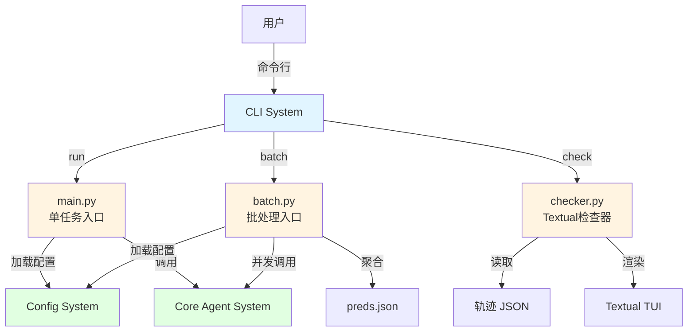
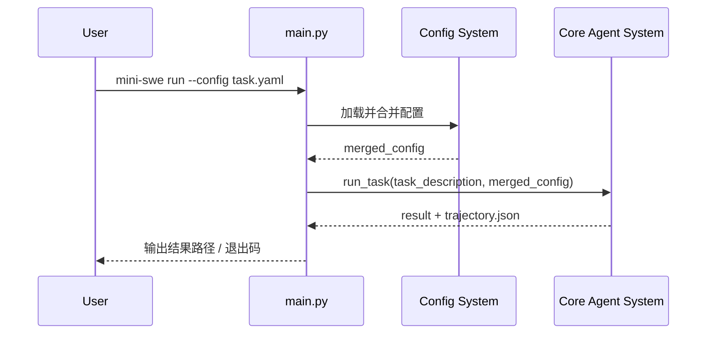
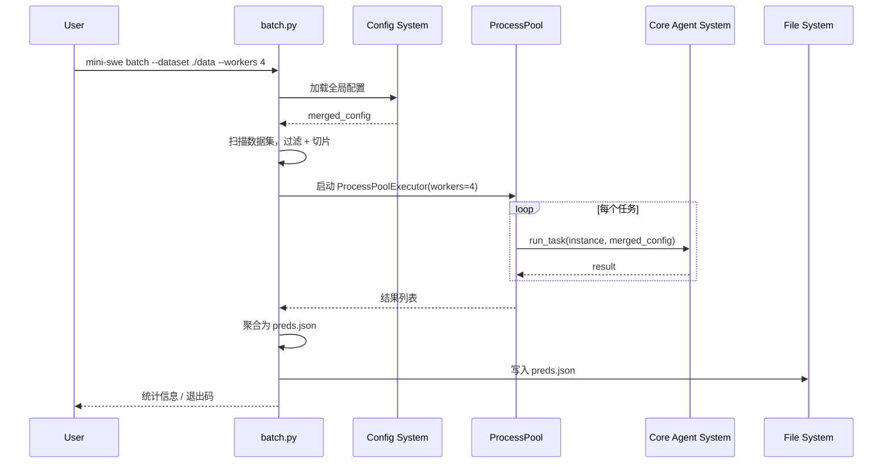
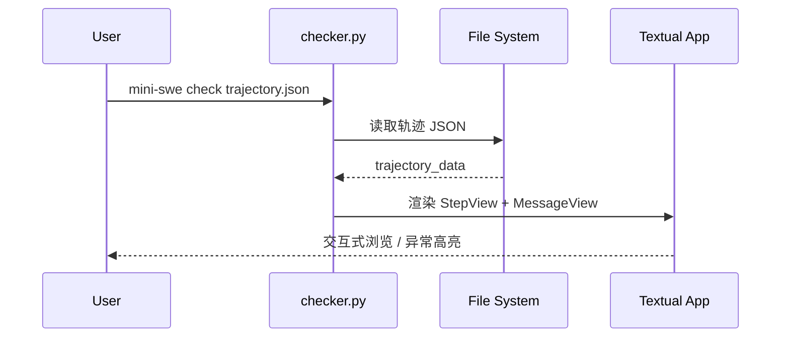

# CLI System 系统设计文档 (L0 — 导航层)

| 字段          | 值                                                                    |
| ------------- | --------------------------------------------------------------------- |
| **System ID** | `cli-system`                                                          |
| **Project**   | mini SWE Agent                                                        |
| **Version**   | 1.0                                                                   |
| **Status**    | `Draft`                                                               |
| **Author**    | System Designer Agent                                                 |
| **Date**      | 2026-05-10                                                            |
| **L1 Detail** | [cli-system.detail.md](./cli-system.detail.md) — 仅 `/forge` 时加载  |

> [!IMPORTANT]
> **文档分层说明**
> - **本文件 (L0 导航层)**: 架构图、操作契约、设计决策。面向快速理解与任务规划。禁止放配置字典、算法伪代码和方法体。
> - **[cli-system.detail.md](./cli-system.detail.md) (L1 实现层)**: 完整伪代码、配置常量、边缘情况。仅 `/forge` 任务明确引用时加载。
> - **L1 锚点原则**: L1 中的每一节都必须在本文件有对应超链接入口。严禁 L1 出现 L0 完全未提及的"孤岛内容"。

---

## 目录 (Table of Contents)

|   §   | 章节                                                         | 关键内容                                                 |
| :---: | ------------------------------------------------------------ | -------------------------------------------------------- |
|   1   | [概览](#1-概览-overview)                                     | 系统目的、边界、职责                                     |
|   2   | [目标与非目标](#2-目标与非目标-goals--non-goals)             | Goals / Non-Goals                                        |
|   3   | [背景与上下文](#3-背景与上下文-background--context)          | 为什么需要这个系统、约束                                 |
|   4   | [系统架构](#4-系统架构-architecture)                         | Mermaid 架构图、组件职责、数据流                         |
|   5   | [接口设计](#5-接口设计-interface-design)                     | 操作契约表、跨系统协议、CLI 参数                         |
|   6   | [数据模型](#6-数据模型-data-model)                           | 实体字段声明 → [L1 §2](./cli-system.detail.md)           |
|   7   | [技术选型](#7-技术选型-technology-stack)                     | 核心技术、关键依赖                                       |
|   8   | [Trade-offs](#8-trade-offs--alternatives-权衡与备选方案)     | 决策理由、备选方案对比                                   |
|   9   | [安全性考虑](#9-安全性考虑-security-considerations)          | 风险警示、命令注入防护                                   |
|  10   | [性能考虑](#10-性能考虑-performance-considerations)          | 并发策略、资源控制                                       |
|  11   | [测试策略](#11-测试策略-testing-strategy)                    | CLI 测试、冒烟测试、TUI 测试                             |
|  12   | [部署与运维](#12-部署与运维-deployment--operations) *(可选)* | 安装、环境要求                                         |
|  13   | [未来考虑](#13-未来考虑-future-considerations) *(可选)*      | 扩展性、技术债                                           |

**L1 实现层** → [cli-system.detail.md](./cli-system.detail.md)（仅 `/forge` 时加载）
> [§1 配置常量](./cli-system.detail.md) · [§2 数据结构](./cli-system.detail.md) · [§3 算法](./cli-system.detail.md) · [§4 决策树](./cli-system.detail.md) · [§5 边缘情况](./cli-system.detail.md)

---

## 1. 概览 (Overview)

### 1.1 System Purpose (系统目的)
提供用户与 mini SWE Agent 的交互入口，负责命令行参数解析、子命令分发、批处理任务并发调度，以及轨迹 JSON 的可视化审查工具。CLI System 是用户与 Core Agent System 之间的唯一桥梁。

### 1.2 System Boundary (系统边界)

- **输入 (Input)**:
  - 用户命令行参数（click 解析）
  - 环境变量（配置覆盖）
  - 批量任务数据集（文件系统路径）
  - 轨迹 JSON 文件（检查器模式）

- **输出 (Output)**:
  - 命令分发到 Core Agent System（单任务）
  - `preds.json`（批量评估结果）
  - TUI 界面（Textual 检查器）
  - 日志与进度信息（stdout/stderr）

- **依赖系统 (Dependencies)**:
  - Config System（配置加载与合并）
  - Core Agent System（任务执行）

- **被依赖系统 (Dependents)**:
  - 无（用户直接调用，不被其他系统依赖。CLI 是 Config System 和 Core Agent System 的调用方）

### 1.3 System Responsibilities (系统职责)

**负责**:
- CLI 主命令入口与参数解析 [REQ-010]
- 子命令分发（`run` / `batch` / `check`）
- 批处理并发调度与结果聚合 [REQ-008]
- Textual TUI 轨迹检查器 [REQ-009]
- `--help` 风险警示文案
- 进程退出码映射（成功/失败）

**不负责**:
- 核心状态机闭环（由 Core Agent System 负责）
- 配置渲染与模板解析（由 Config System 负责）
- 动作解析与执行（由 Core Agent System 负责）
- 模型 API 调用（由 Core Agent System 负责）

---

## 2. 目标与非目标 (Goals & Non-Goals)

### 2.1 Goals

- **[G1]**: 提供统一的 CLI 入口，支持 `run` / `batch` / `check` 三个子命令
- **[G2]**: 批处理支持 multiprocessing 并发，workers 可配置，默认 CPU 数
- **[G3]**: 批处理支持 regex 过滤、切片（slice）、确定性 shuffle、redo_existing 重跑
- **[G4]**: `preds.json` 输出符合 schema，含 `model_patch` 与 `instance_id` 字段
- **[G5]**: Textual 检查器支持按步聚合、高亮异常步骤（FormatError 等）、ANSI/NUL 鲁棒处理
- **[G6]**: CLI 参数覆盖优先级高于文件配置（与 ADR-004 一致）

### 2.2 Non-Goals

- **[NG1]**: 不提供 Web UI 或远程服务接口
- **[NG2]**: 不提供交互式配置编辑器
- **[NG3]**: 不提供任务依赖编排（仅简单并行）
- **[NG4]**: 不提供轨迹编辑或重新执行功能（仅查看）

---

## 3. 背景与上下文 (Background & Context)

### 3.1 Why This System? (为什么需要这个系统？)

研究者需要一种标准化的方式来：
1. **运行单个任务**：快速验证 agent 在特定问题上的表现
2. **批量评估**：在 benchmark 数据集上运行 hundreds/thousands 个任务，生成可提交的 `preds.json`
3. **审查轨迹**：事后分析失败原因，高亮异常步骤

CLI System 将这三种模式封装为统一的命令行工具，降低使用门槛。

**关联PRD需求**: [REQ-010] CLI 主命令, [REQ-008] 批处理模式, [REQ-009] Textual 检查器

### 3.2 Current State (现状分析)

本项目从 0 开始构建，无遗留 CLI 代码。需要全新设计三个子命令的入口、参数体系和退出语义。

### 3.3 Constraints (约束条件)

- **技术约束**: Python 3.10+，click 框架，textual TUI，multiprocessing 并发
- **性能约束**: 批处理默认 workers = CPU 数，单任务超时由 Core Agent System 控制（120s）
- **安全约束**: 风险警示（--help 中明确提示 agent 会执行 Shell 命令），禁止在 CLI 层硬编码密钥
- **兼容性约束**: Windows / macOS / Linux 跨平台，路径处理使用 `pathlib`

---

## 4. 系统架构 (Architecture)

### 4.1 Architecture Diagram (架构图)



### 4.2 Core Components (核心组件)

| Component Name | Responsibility | Tech Stack | Notes |
| -------------- | -------------- | ---------- | ----- |
| `main.py` | 单任务 CLI 入口，参数解析，调用 Core Agent | click | `--config`, `--model`, `--yolo` 等参数 |
| `batch.py` | 批处理调度，并发控制，结果聚合 | click, multiprocessing | workers, filter, slice, redo_existing |
| `checker.py` | Textual TUI 轨迹审查器 | click, textual | 按步聚合，异常高亮 |

### 4.3 Data Flow (数据流)

#### 单任务模式 (`run`)



#### 批处理模式 (`batch`)



#### 检查器模式 (`check`)



---

## 5. 接口设计 (Interface Design)

### 5.1 操作契约表 (Operation Contracts)

| 操作 | [REQ-XXX] | 前置条件 | 消耗/输入 | 产出/副作用 | 实现细节 |
| ---- | :-------: | -------- | --------- | ----------- | :------: |
| `run(config_path, overrides)` | [REQ-010] | 配置文件存在; Python 3.10+ | CLI 参数 | 轨迹 JSON 写入磁盘; 退出码 0/1 | [§3.1](./cli-system.detail.md) |
| `batch(dataset_path, config_path, workers, filter_regex, slice_range, shuffle_seed, redo_existing)` | [REQ-008] | 数据集目录存在; config 有效 | 数据集路径 + 参数 | preds.json 写入磁盘; 子进程日志 | [§3.2 + §3.2b](./cli-system.detail.md) |
| `check(trajectory_path)` | [REQ-009] | 轨迹文件存在且为合法 JSON | 轨迹文件路径 | Textual TUI 启动; 用户交互浏览 | [§3.3](./cli-system.detail.md) |
| `print_risk_banner()` | [REQ-010] | --help 或 --risk-banner 触发 | 无 | stdout 风险警示文案 | [§3.4](./cli-system.detail.md) |

> **填写说明**:
> - **操作**: 使用函数签名风格，参数只写关键入参
> - **前置条件**: 简洁列举，以「;」分隔
> - **产出/副作用**: 描述状态变化与文件/进程副作用
> - **实现细节**: 链接到 `.detail.md` 对应章节

### 5.2 跨系统接口协议 (Cross-System Interface)

CLI System 与 Core Agent System 的调用协议：

```python
# CLI → Core Agent 调用协议
# 文件: src/cli/main.py, src/cli/batch.py

class AgentRunner(Protocol):
    def run_task(
        self,
        task_description: str,
        config: dict,
        output_dir: Path | None = None,
    ) -> AgentResult:
        ...

@dataclass
class AgentResult:
    trajectory_path: Path      # 轨迹 JSON 路径
    final_state: str           # SUBMITTED / LIMIT_STEP / ...
    overall_output: str | None # 最终提交内容（仅 SUBMITTED）
    returncode: int            # 0 = 成功，1 = 失败
```

> **说明**: `AgentResult` 是 CLI System 消费 Core Agent System 产出的契约。Core Agent System 必须保证 `trajectory_path` 指向的文件在返回时已完整写入。

### 5.3 CLI 参数语义 (CLI Parameter Semantics)

#### `mini-swe run`

| 参数 | 类型 | 必需 | 默认值 | 配置文件键名 | 说明 |
| ---- | ---- | :--: | ------ | ----------- | ---- |
| `--config`, `-c` | Path | 是 | - | - | 任务配置文件（YAML） |
| `--model`, `-m` | str | 否 | 配置文件中指定 | `model_name_or_path` | 覆盖模型名称 |
| `--yolo` | flag | 否 | False | `yolo` | 自动确认模式（跳过人工确认） |
| `--output-dir`, `-o` | Path | 否 | `./outputs` | `output_dir` | 轨迹输出目录 |
| `--verbose`, `-v` | flag | 否 | False | `verbose` | 详细日志 |

#### `mini-swe batch`

| 参数 | 类型 | 必需 | 默认值 | 配置文件键名 | 说明 |
| ---- | ---- | :--: | ------ | ----------- | ---- |
| `--dataset` | Path | 是 | - | `dataset_path` | 数据集目录（含 instance.jsonl） |
| `--config` | Path | 是 | - | - | 全局配置文件 |
| `--workers`, `-j` | int | 否 | CPU_COUNT | `workers` | 并发进程数 |
| `--filter` | str | 否 | None | `filter_regex` | regex 过滤 instance_id |
| `--slice` | str | 否 | None | `slice_range` | Python 切片语法，如 `0:100` |
| `--shuffle-seed` | int | 否 | None | `shuffle_seed` | 确定性 shuffle 种子 |
| `--redo-existing` | flag | 否 | False | `redo_existing` | 重跑已有轨迹的任务 |
| `--output`, `-o` | Path | 否 | `./preds.json` | `output_path` | 输出文件路径 |

#### `mini-swe check`

| 参数 | 类型 | 必需 | 默认值 | 说明 |
| ---- | ---- | :--: | ------ | ---- |
| `trajectory` | Path | 是 | - | 轨迹 JSON 文件路径 |

### 5.4 批处理错误处理与退出码语义

**错误处理策略**:
- **Worker 进程异常退出**（OOM、segfault）：捕获异常，记录 `terminal_state="WORKER_CRASH"`，继续处理其他任务
- **单个任务执行失败**（FATAL_CONFIG、UNKNOWN_ERROR 等）：记录终态和 error 字段到 preds.json，继续处理其他任务
- **配置加载失败**（Jinja2 StrictUndefined / YAML 语法错误）：CLI 层捕获 ConfigError 后，在诊断目录写入最小化诊断信息（含错误类型、配置文件路径），不启动 Core Agent（CH-R2-02）
- **默认行为**：`--continue-on-error` 默认为 True，失败不中断整个批次

**批处理轨迹文件命名策略（CH-R2-03）**:
- 每个任务独立轨迹文件：由 CLI 层构造 `{output_dir}/trajectory_{instance_id}.jsonl`，作为参数传入 Core Agent
- 若文件已存在且 `--redo-existing` 为 False：跳过该任务
- 若文件已存在且 `--redo-existing` 为 True：覆盖（旧轨迹归档为 `{filename}.bak`）
- Core Agent 接收 `trajectory_path` 参数，由 CLI 层负责构造完整路径并管理冲突

**退出码映射表**:

| 场景 | 退出码 | 说明 |
|------|--------|------|
| 所有任务完成，preds.json 已生成 | 0 | 无论成功/失败，批次执行流程正常结束 |
| 部分任务失败但 preds.json 已生成 | 20 | `BATCH_PARTIAL_FAILURE`，可配合 `--redo-existing` 重跑 |
| 所有任务均失败，preds.json 为空 | 1 | 严重错误，需检查配置或数据集 |
| 用户中断（Ctrl+C） | 130 | SIGINT 标准退出码 |

**preds.json 失败任务记录格式**:
```json
{
  "instance_id": "...",
  "model_name_or_path": "...",
  "model_patch": null,
  "status": "failed",
  "terminal_state": "FATAL_CONFIG",
  "error": "配置错误: 缺少 model_name"
}
```

---

## 6. 数据模型 (Data Model)

### 6.1 核心实体属性声明

```python
@dataclass
class BatchConfig:
    dataset_path: Path          # 数据集目录
    global_config_path: Path    # 全局配置文件
    workers: int                # 并发进程数，默认 os.cpu_count()
    filter_regex: str | None    # instance_id 过滤正则
    slice_range: tuple[int, int] | None  # (start, stop)
    shuffle_seed: int | None    # 确定性 shuffle 种子
    redo_existing: bool         # 是否重跑已有结果
    output_path: Path          # preds.json 输出路径

@dataclass
class PredEntry:
    instance_id: str            # 任务唯一标识
    model_name_or_path: str     # 模型名称（映射自 --model 参数或配置文件）
    model_patch: str | None     # 最终提交的 patch（无则为 None）
    test_result: str | None     # 测试结果摘要（可选扩展）
    status: str                 # "success" | "failed" | "skipped"
    terminal_state: str | None  # SUBMITTED / LIMIT_STEP / ...（失败时非 None）
    error: str | None           # 失败原因（失败时非 None）

@dataclass
class BatchResult:
    total: int                  # 总任务数
    completed: int              # 成功完成数
    failed: int                 # 失败数
    skipped: int                # 跳过数（已有且不 redo）
    preds: list[PredEntry]        # 结果列表
    output_path: Path           # 写入路径
```

> **常量字典配置详见** [L1 §1](./cli-system.detail.md)
> **完整方法实现详见** [L1 §2](./cli-system.detail.md)

---

## 7. 技术选型 (Technology Stack)

| 技术 | 用途 | 版本约束 |
|------|------|----------|
| Python 3.10+ | 运行环境 | >= 3.10（match 语句、联合类型 `\| `） |
| click | CLI 框架 | >= 8.0 |
| textual | TUI 框架 | >= 0.50 |
| multiprocessing | 批处理并发 | 标准库 |
| pathlib | 跨平台路径 | 标准库 |
| json | preds.json 序列化 | 标准库 |

> **决策来源**: [ADR-001: 技术栈选型](../03_ADR/ADR_001_TECH_STACK.md)
>
> 本系统实现 ADR-001 定义的技术栈选择，不在此重复决策理由。

---

## 8. Trade-offs & Alternatives (权衡与备选方案)

### Decision 1: CLI 框架选择 — click vs typer vs argparse

> **决策来源**: [ADR-001: 技术栈选型](../03_ADR/ADR_001_TECH_STACK.md)
>
> 本系统实现 ADR-001 定义的设计，不在此重复决策理由。

### Decision 2: 并发模型 — multiprocessing vs threading vs asyncio

> **决策来源**: [ADR-001: 技术栈选型](../03_ADR/ADR_001_TECH_STACK.md)
>
> 本系统实现 ADR-001 定义的设计，不在此重复决策理由。

### Decision 3: 批处理结果聚合 — 内存聚合 vs 流式写入

**Option A: 内存聚合后一次性写入 (Selected)**
- 优点: 实现简单；保证 preds.json 原子性；便于 schema 校验
- 缺点: 内存占用随任务数线性增长（10K 任务约数 MB，可接受）

**Option B: 流式追加写入**
- 优点: 内存占用恒定；实时可见进度
- 缺点: 需处理并发写入锁；JSON 格式不支持流式追加（需首尾包装）；中间失败产生不完整文件

**Decision**: 选择 A。因为 preds.json 通常 < 100MB，内存聚合风险可控；且 JSON 数组格式天然不适合流式追加。中间结果通过单任务轨迹文件持久化，不依赖 preds.json 的实时性。

### Decision 4: 检查器渲染策略 — 全量加载 vs 虚拟滚动

**Option A: 全量加载 (Selected)**
- 优点: 实现简单；Textual 的 DataTable 已内置虚拟滚动；轨迹文件通常 < 10MB
- 缺点: 极大轨迹（>100MB）启动时解析延迟

**Option B: 按需流式解析**
- 优点: 恒定内存；支持任意大小文件
- 缺点: 实现复杂；需维护行号索引；随机跳转困难

**Decision**: 选择 A。因为轨迹 JSON 通常几 MB 到几十 MB，全量加载在 modern machine 上 < 1s。若未来遇到超大轨迹，可在 check 前提供 `split` 子命令预处理。

### Decision 5: CLI 参数与配置文件的优先级

> **决策来源**: [ADR-004: 配置管理策略](../03_ADR/ADR_004_CONFIG_MANAGEMENT.md)
>
> 优先级: CLI 参数 > 配置文件 > 环境变量 > 默认值。本系统实现 ADR-004 定义的合并策略。

---

## 9. 安全性考虑 (Security Considerations)

### 9.1 风险警示 (Risk Banner)

CLI System **必须**在 `run` / `batch` 命令启动时**始终**显示风险警示，无论是否使用 `--yolo`：

> ⚠️ **Warning**: This tool executes shell commands automatically. Review the task description and configuration before running. Use `--yolo` with caution.

- `--yolo` 仅控制是否暂停等待人工确认 `y/n`，**不控制**警示是否显示
- 风险警示输出到 stderr，避免污染 stdout

**为什么**: 用户可能在不了解后果的情况下运行 agent，导致文件系统被破坏。即使在自动确认模式下，用户仍有权在终端历史记录中看到曾收到的警示。

### 9.2 命令注入防护

- CLI System **不负责**解析模型生成的命令（由 Core Agent System 的 Parser 负责）
- CLI System 仅传递配置，不直接拼接 Shell 字符串
- 批处理模式下，`instance_id` 仅用于文件路径生成，必须经过 `pathlib.Path` 净化，禁止包含 `..` 或绝对路径穿越

### 9.3 密钥管理

- CLI System **禁止**提供 `--api-key` 参数（避免泄露到 shell history）
- API 密钥仅通过环境变量或配置文件读取，由 Config System 管理
- 配置文件权限检查：若配置文件权限过于开放（world-readable 且含敏感字段），发出警告

---

## 10. 性能考虑 (Performance Considerations)

### 10.1 性能目标

| 指标 | 目标 | 说明 |
|------|------|------|
| 单任务启动延迟 | < 500ms | 从 CLI 调用到 Core Agent System 启动 |
| 批处理并发效率 | > 80% | workers=CPU 时，CPU 利用率 |
| 批处理任务超时 | 联动 Core Agent | `step_limit × step_timeout + 30s` 缓冲，默认 100×120+30 = 12,030s |
| 检查器加载 | < 1s | 10MB 轨迹文件解析并渲染 |
| preds.json 写入 | < 100ms | 1K 任务结果序列化 |

### 10.2 优化策略

- **进程池复用**: `ProcessPoolExecutor` 在批处理开始时创建，所有任务共享，避免频繁 fork
- **I/O 并行**: 轨迹写入与网络调用由 Core Agent System 处理，CLI 层仅负责轻量级聚合
- **确定性 shuffle**: 使用固定种子，便于复现和问题定位

### 10.3 资源控制

- `--workers` 上限为 `max(os.cpu_count(), 16)`，防止误输入过大值
- 批处理前预检查磁盘空间（输出目录），不足时提前失败
- 子进程异常隔离：单个任务失败不影响其他任务和进程池

---

## 11. 测试策略 (Testing Strategy)

> **决策来源**: [ADR-002: 测试策略与质量门禁](../03_ADR/ADR_002_TESTING_STRATEGY.md)
>
> 本系统实现 ADR-002 定义的分层测试策略。

### 11.1 单元测试

| 测试目标 | 覆盖内容 | 所在文件 |
|----------|----------|----------|
| CLI 参数解析 | click 参数组合、默认值、类型转换 | `tests/unit/cli/test_args.py` |
| 批处理过滤/切片 | regex 过滤、Python slice 解析、shuffle | `tests/unit/cli/test_batch.py` |
| PredEntry schema | preds.json 字段存在性、类型 | `tests/unit/cli/test_schema.py` |

### 11.2 集成测试

| 测试目标 | 覆盖内容 | 所在文件 |
|----------|----------|----------|
| CLI → Config → Core 链 | `mini-swe run` 完整端到端（mock Core Agent） | `tests/integration/test_cli_run.py` |
| 批处理并发 | `mini-swe batch` 多任务调度（mock Core Agent） | `tests/integration/test_cli_batch.py` |

### 11.3 冒烟测试

- `preds.json` schema 验证：使用 jsonschema 或 pydantic 校验输出格式
- 检查器启动测试：验证 Textual App 初始化不抛异常

### 11.4 Contract Verification Matrix (契约验证矩阵)

> **为什么必填**: CLI System 定义了公共接口（CLI 参数语义、preds.json schema、AgentResult 契约），这些契约会直接进入 `/blueprint` 和 `/forge`。

| 契约 | 验证方式 | 责任方 | 验证时机 |
|------|----------|--------|--------|
| `AgentResult` 字段完整性 | 单元测试 + 类型检查 | Core Agent System | 提交前 |
| CLI 参数默认值 | 单元测试 | CLI System | 提交前 |
| `preds.json` schema | 冒烟测试（jsonschema） | CLI System | 提交前 |
| `--workers` 上限 | 单元测试 | CLI System | 提交前 |
| 风险警示输出 | 单元测试（stdout capture） | CLI System | 提交前 |
| `instance_id` 路径净化 | 单元测试 | CLI System | 提交前 |

---

## 12. 部署与运维 (Deployment & Operations)

### 12.1 安装

```bash
pip install -e .
# 或
pip install mini-swe-agent
```

### 12.2 环境要求

- Python 3.10+
- 可选: 终端支持 ANSI 颜色（检查器体验更佳）

### 12.3 日志

- CLI 层日志输出到 stderr，避免污染 stdout（与 TUI 或管道兼容）
- 批处理模式下，子进程日志通过 `multiprocessing.Queue` 聚合到主进程 stderr

---

## 13. 未来考虑 (Future Considerations)

### 13.1 扩展性

- **检查器增强**: 支持多轨迹文件对比、diff 视图、导出 HTML 报告
- **批处理增强**: 支持 resume（中断后继续），基于已完成轨迹自动跳过
- **插件化 CLI**: 未来可通过 entry points 支持第三方子命令

### 13.2 技术债预警

- multiprocessing 在 Windows 上的 `spawn` 模式比 Unix `fork` 慢，且需确保 `if __name__ == "__main__"` 保护
- textual 版本迭代快，需锁定最低版本并在 CI 中测试最新版

---

## 14. 附录 (Appendix)

### 14.1 术语表

| 术语 | 解释 |
|------|------|
| `preds.json` | 批量评估结果文件，符合 SWE-bench 提交格式 |
| `trajectory.json` | 单任务执行轨迹，含消息历史与元数据 |
| `yolo` | 自动确认模式，跳过人工确认直接执行 |
| `redo_existing` | 批处理参数，是否覆盖已有输出目录的轨迹 |

### 14.2 参考资料

- [ADR-001: 技术栈选型](../03_ADR/ADR_001_TECH_STACK.md)
- [ADR-002: 测试策略](../03_ADR/ADR_002_TESTING_STRATEGY.md)
- [ADR-004: 配置管理策略](../03_ADR/ADR_004_CONFIG_MANAGEMENT.md)
- [core-agent.md](./core-agent.md) — Core Agent System 设计文档
