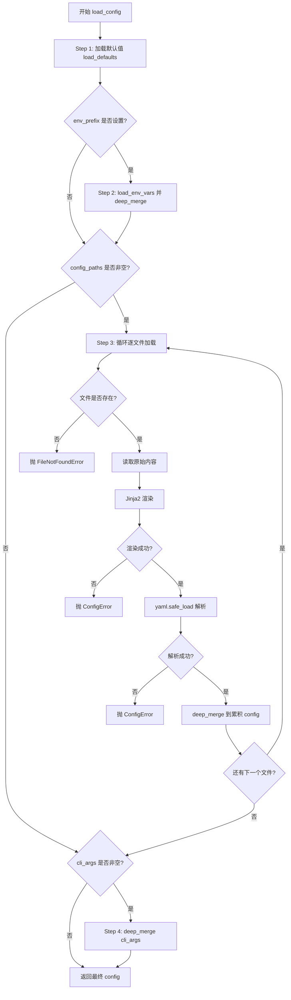
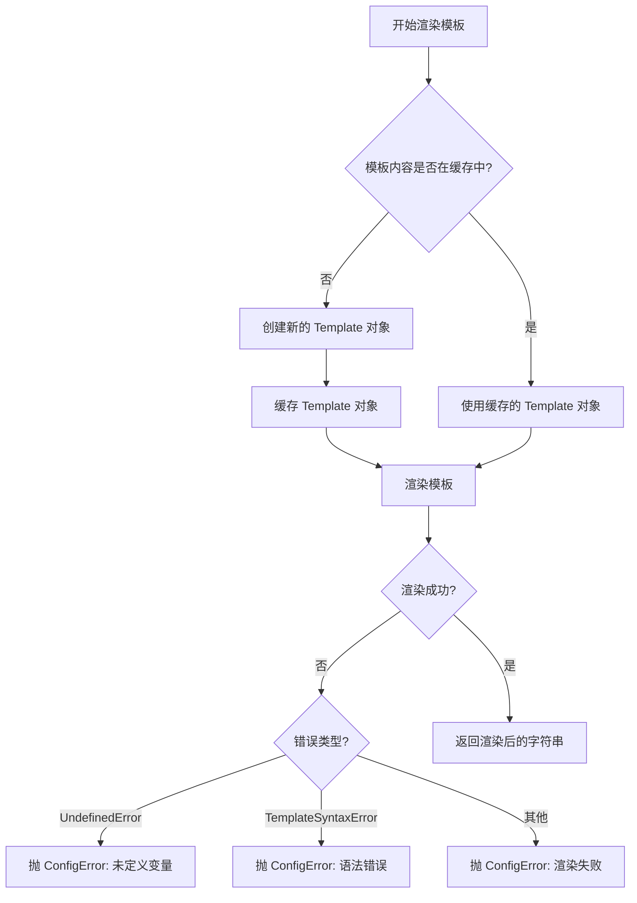

# Config System 系统设计文档 (L1 — 实现层)

> [!IMPORTANT]
> **本文件为 L1 实现层，仅 `/forge` 任务明确引用时加载。**
> 
> L1 包含完整伪代码、配置常量、边缘情况等实现细节。所有章节在 [config.md](./config.md) 中都有对应锚点入口。

---

## 版本历史

| 版本 | 日期       | Changelog |
| ---- | ---------- | --------- |
| v1.0 | 2026-05-10 | 初始版本  |
| v1.1 | 2026-05-10 | Challenge Round 1 P1 修复：H8(敏感信息过滤)、H9(Jinja2模式) |
| v1.2 | 2026-05-11 | Challenge Round 4 修复：CH-R4-03(cost_estimate_per_call 默认值)、CH-R4-01(max_consecutive_format_errors 默认值) |

---

## §1 配置常量

### 1.1 配置优先级常量

```python
# 配置源优先级（从低到高）
PRIORITY_DEFAULT = 0    # 默认值
PRIORITY_ENV = 1        # 环境变量
PRIORITY_FILE = 2       # 配置文件
PRIORITY_CLI = 3        # CLI 参数
```

### 1.2 观测截断常量

```python
# 观测截断配置（根据 ADR-004）
DEFAULT_MAX_OBSERVATION_LENGTH = 10000  # 默认最大长度
TRUNCATE_PREFIX_LENGTH = 5000           # 前缀长度
TRUNCATE_SUFFIX_LENGTH = 5000           # 后缀长度
```

### 1.3 业务默认值字典

> 以下为 `ConfigLoader.load_defaults()` 的实际返回值。字段名即 YAML key，与 CLI 参数名一一对应（`--cost-limit` → `cost_limit`）。
> 来源依据：PRD US-003（执行超时 120s）、US-005（重试 5 次）、US-010（CLI 参数列表）、ADR-001（技术栈）。

```python
DEFAULT_CONFIG: dict[str, Any] = {
    # ── 模型 ──────────────────────────────────────────────────
    "model": {
        "name": "gpt-4o",              # litellm 模型标识符（可被 --model 覆盖）
        "protocol": "tool_call",       # "tool_call" | "text"（ADR-005）
        "api_key": None,               # 必须由环境变量覆盖，禁止硬编码（ADR-004）
        "max_retries": 5,              # 网络/API 错误重试次数（ADR-003）
        "cost_missing_strategy": "warn",  # "ignore" | "warn" | "error"（ADR-007）
    },

    # ── 执行器 ────────────────────────────────────────────────
    "executor": {
        "timeout": 120,            # 单步 Shell 超时秒数（PRD US-003 边界条件1）
    },

    # ── Agent 上限 ────────────────────────────────────────────
    "agent": {
        "step_limit": 50,                     # 最大步数上限（--step-limit）
        "cost_limit": 2.0,                    # 最大成本上限（USD，--cost-limit）
        "cost_estimate_per_call": 0.05,       # 成本上限预防性检查估算值（USD/次，CH-R4-03）
        "confirm_mode": True,                 # 默认 confirm 模式（--yolo 覆盖为 False）
        "exit_immediately": False,            # 首步执行后立即退出（--exit-immediately）
        "max_consecutive_format_errors": 5,   # FormatError 防循环阈值（CH-R4-01）
    },

    # ── 输出 ──────────────────────────────────────────────────
    "output": {
        "trajectory_path": None,   # 轨迹输出路径（--output，None = 自动生成）
        "observation_max_length": DEFAULT_MAX_OBSERVATION_LENGTH,
    },
}
```

### 1.4 Jinja2 环境配置

```python
# Jinja2 环境配置
JINJA2_CONFIG = {
    "undefined": jinja2.StrictUndefined,  # StrictUndefined 模式
    "trim_blocks": True,                  # 移除块后的换行
    "lstrip_blocks": True,                # 移除块前的空白
}
```

---

## §2 数据结构

> 以下为完整属性 + 方法签名声明；方法体见 §3 算法伪代码。

### 2.1 ConfigManager 类

```python
class ConfigManager:
    """配置管理器：统一加载、合并、渲染入口；内部组合 Loader / Merger / Renderer。

    安全：打印 / repr 时自动脱敏敏感字段（api_key 等），避免密钥泄露到日志。
    """

    jinja_env: jinja2.Environment           # Jinja2 环境（StrictUndefined，仅用于观测模板）
    _loader: ConfigLoader                   # 各源加载器
    _merger: ConfigMerger                   # 递归合并器
    _renderer: TemplateRenderer             # 模板渲染器
    _config_cache: dict[str, Any]           # 已合并配置缓存（key 为 cache_key）
    _template_cache: dict[str, jinja2.Template]  # 编译后模板缓存

    # 敏感字段列表：repr / 日志中自动替换为 "***"
    SENSITIVE_KEYS: frozenset[str] = frozenset({"api_key", "password", "token", "secret"})

    def __init__(self) -> None: ...

    def _redact(self, obj: Any) -> Any:
        """递归脱敏：将包含敏感 key 的字符串值替换为 '***'。"""
        if isinstance(obj, dict):
            return {
                k: "***" if k in self.SENSITIVE_KEYS and isinstance(v, str) else self._redact(v)
                for k, v in obj.items()
            }
        if isinstance(obj, list):
            return [self._redact(item) for item in obj]
        return obj

    def __repr__(self) -> str:
        """打印时自动脱敏敏感字段。"""
        return f"ConfigManager(config={self._redact(self._config_cache)})"

    # ── 公共接口（对应 IConfigManager Protocol）──
    def load_config(
        self,
        config_paths: list[str] | None = None,
        cli_args: dict[str, Any] | None = None,
        env_prefix: str | None = None,
    ) -> dict[str, Any]: ...

    def render_template(
        self,
        template_content: str,
        context: dict[str, Any],
    ) -> str: ...

    def truncate_observation(
        self,
        output: str,
        max_length: int = DEFAULT_MAX_OBSERVATION_LENGTH,
    ) -> str: ...

    def clear_cache(self) -> None: ...

    # ── 私有辅助 ──
    def _load_defaults(self) -> dict[str, Any]: ...
```

### 2.2 ConfigLoader 类

```python
class ConfigLoader:
    """从不同配置源读取并返回原始 dict；不做合并，不做渲染。"""

    def load_yaml_file(
        self,
        path: str,
        renderer: "TemplateRenderer",
    ) -> dict[str, Any]:
        """读取 YAML 文件：先 Jinja2 渲染，再 yaml.safe_load 解析。
        
        Raises:
            FileNotFoundError: 文件不存在
            ConfigError: YAML 语法错误 / Jinja2 渲染失败
        """
        ...

    def load_env_vars(self, prefix: str) -> dict[str, Any]:
        """读取以 prefix 开头的环境变量，转换为嵌套 dict（下划线 → 层级）。
        
        Returns:
            匹配的环境变量构成的 dict；无匹配则返回 {}
        """
        ...

    def load_defaults(self) -> dict[str, Any]:
        """返回硬编码的默认配置 dict。"""
        ...
```

### 2.3 ConfigMerger 类

```python
class ConfigMerger:
    """递归合并两个配置 dict；不产生副作用，每次返回新 dict。"""

    def deep_merge(
        self,
        base: dict[str, Any] | None,
        override: dict[str, Any] | None,
    ) -> dict[str, Any]:
        """策略：dict → 递归合并；其余类型（含 list）→ override 覆盖 base。
        
        Args:
            base:     基础字典（None 等价于 {}）
            override: 覆盖字典（None 等价于 {}）
        
        Returns:
            合并后的新字典
        """
        ...
```

### 2.4 TemplateRenderer 类

```python
class TemplateRenderer:
    """Jinja2 模板渲染与观测截断；与 ConfigManager 共享同一个 jinja_env 实例。"""

    jinja_env: jinja2.Environment
    _template_cache: dict[str, jinja2.Template]  # hash(content) → Template

    def __init__(self, jinja_env: jinja2.Environment) -> None: ...

    def render(
        self,
        template_content: str,
        context: dict[str, Any],
    ) -> str:
        """使用 StrictUndefined 渲染模板字符串。
        
        Raises:
            ConfigError: 未定义变量（UndefinedError）或语法错误（TemplateSyntaxError）
        """
        ...

    def truncate(
        self,
        output: str,
        max_length: int = DEFAULT_MAX_OBSERVATION_LENGTH,
    ) -> str:
        """若 len(output) >= max_length，截断为前 5000 + 后 5000 并 warning。"""
        ...
```

---

## §3 算法伪代码

> 方法归属说明：§3.1–3.2 属于 `ConfigManager`；§3.3 属于 `TemplateRenderer`；§3.4 属于 `ConfigMerger`；§3.5 属于 `ConfigLoader`。

### 3.1 ConfigManager.load_config

```python
# ConfigManager 方法
def load_config(
    self,
    config_paths: list[str] | None = None,
    cli_args: dict[str, Any] | None = None,
    env_prefix: str | None = None,
) -> dict[str, Any]:
    """
    加载并合并多源配置。
    优先级（低→高）：默认值 → 环境变量 → 配置文件（按传入顺序） → CLI 参数
    """
    # Step 1: 从默认值出发
    config = self._loader.load_defaults()

    # Step 2: 叠加环境变量
    if env_prefix:
        env_config = self._loader.load_env_vars(env_prefix)
        config = self._merger.deep_merge(config, env_config)

    # Step 3: 逐文件叠加（后传入的文件优先级更高）
    for path in (config_paths or []):
        file_config = self._loader.load_yaml_file(path, self._renderer)
        config = self._merger.deep_merge(config, file_config)

    # Step 4: CLI 参数最高优先级
    if cli_args:
        config = self._merger.deep_merge(config, cli_args)

    return config
```

### 3.2 ConfigManager.render_template / truncate_observation

```python
# ConfigManager 方法（委托给 _renderer）
def render_template(self, template_content: str, context: dict[str, Any]) -> str:
    return self._renderer.render(template_content, context)

def truncate_observation(self, output: str, max_length: int = DEFAULT_MAX_OBSERVATION_LENGTH) -> str:
    return self._renderer.truncate(output, max_length)

def clear_cache(self) -> None:
    self._config_cache.clear()
    self._renderer._template_cache.clear()

def _load_defaults(self) -> dict[str, Any]:
    """返回硬编码默认配置；实际值见 §1 配置常量。"""
    return self._loader.load_defaults()
```

### 3.3 TemplateRenderer.render / truncate

```python
# TemplateRenderer 方法
def render(self, template_content: str, context: dict[str, Any]) -> str:
    """Jinja2 渲染，StrictUndefined 模式。"""
    cache_key = hash(template_content)
    if cache_key not in self._template_cache:
        self._template_cache[cache_key] = self.jinja_env.from_string(template_content)
    template = self._template_cache[cache_key]

    try:
        return template.render(**context)
    except jinja2.UndefinedError as e:
        raise ConfigError(f"Template rendering failed: undefined variable — {e.message}") from e
    except jinja2.TemplateSyntaxError as e:
        raise ConfigError(f"Template syntax error at line {e.lineno}: {e.message}") from e


def truncate(self, output: str, max_length: int = DEFAULT_MAX_OBSERVATION_LENGTH) -> str:
    """根据 ADR-004：>= max_length 时截断为前 5000 + 后 5000。"""
    if max_length <= 0:
        raise ValueError(f"max_length must be positive, got {max_length}")
    if len(output) < max_length:
        return output
    elided = len(output) - max_length
    logger.warning(f"Observation truncated, elided {elided} chars (original: {len(output)})")
    return output[:TRUNCATE_PREFIX_LENGTH] + output[-TRUNCATE_SUFFIX_LENGTH:]
```

### 3.4 ConfigMerger.deep_merge

```python
# ConfigMerger 方法
def deep_merge(
    self,
    base: dict[str, Any] | None,
    override: dict[str, Any] | None,
) -> dict[str, Any]:
    """
    递归合并：dict → 递归；其余（含 list）→ override 覆盖 base。
    None 输入等价于空 dict，不崩溃。
    """
    base = base or {}
    override = override or {}
    result = base.copy()

    for key, value in override.items():
        if key in result and isinstance(result[key], dict) and isinstance(value, dict):
            result[key] = self.deep_merge(result[key], value)
        else:
            result[key] = value

    return result
```

### 3.5 ConfigLoader.load_yaml_file

```python
# ConfigLoader 方法
def load_yaml_file(self, path: str, renderer: TemplateRenderer) -> dict[str, Any]:
    """先 Jinja2 渲染，再 yaml.safe_load；出错均包装为 ConfigError。

    注意：YAML 文件中的 Jinja2 模板使用宽松的 Undefined 策略，允许可选变量
    使用 default 过滤器（如 {{ optional | default('fallback') }}），避免未定义
    变量导致整个配置文件加载失败。观测模板渲染仍使用 StrictUndefined（§3.3）。
    """
    if not os.path.exists(path):
        raise FileNotFoundError(f"Configuration file not found: {path}")

    with open(path, "r", encoding="utf-8") as f:
        raw = f.read()

    # Step 1: Jinja2 渲染（YAML 文件级使用宽松策略，允许可选变量）
    try:
        # 使用 DebugUndefined 或提供默认上下文，避免未定义变量阻断配置加载
        # 观测模板仍走 renderer.render()（StrictUndefined），此处仅用于配置文件
        yaml_jinja_env = jinja2.Environment(undefined=jinja2.DebugUndefined)
        rendered = yaml_jinja_env.from_string(raw).render()
    except jinja2.TemplateSyntaxError as e:
        raise ConfigError(f"Jinja2 syntax error in {path}: {e}") from e
    except jinja2.UndefinedError as e:
        # 日志中脱敏敏感信息（避免泄露模板中的变量值）
        logger.warning(f"Undefined variable in {path}: {e}")
        raise ConfigError(f"Undefined variable in {path}: {str(e)[:200]}") from e

    # Step 2: YAML 解析
    try:
        result = yaml.safe_load(rendered)
    except yaml.YAMLError as e:
        # 错误信息中脱敏敏感字段
        error_msg = str(e)
        if "api_key" in error_msg.lower() or "password" in error_msg.lower():
            error_msg = re.sub(r'(api_key|password|token|secret)[=:]\s*\S+', r'\1=***', error_msg, flags=re.IGNORECASE)
        raise ConfigError(f"YAML syntax error in {path}: {error_msg}") from e

    return result or {}
```

### 3.6 ConfigLoader.load_env_vars

```python
# ConfigLoader 方法
def load_env_vars(self, prefix: str) -> dict[str, Any]:
    """
    读取以 prefix 开头的环境变量，转换为嵌套 dict。

    转换规则（以 prefix="SWE_AGENT" 为例）：
      SWE_AGENT_MODEL__NAME=gpt-4o
        → strip prefix → MODEL__NAME=gpt-4o
        → 双下划线分层 → ["MODEL", "NAME"]
        → 嵌套 dict   → {"model": {"name": "gpt-4o"}}

    层级分隔符：双下划线 "__"（避免与 Python 变量名单下划线冲突）
    键名统一转小写。
    """
    if not prefix:
        return {}

    prefix_upper = prefix.upper() + "_"
    result: dict[str, Any] = {}

    for key, value in os.environ.items():
        if not key.upper().startswith(prefix_upper):
            continue

        # 去掉前缀，按双下划线分层
        stripped = key[len(prefix_upper):]       # e.g. "MODEL__NAME"
        parts = [p.lower() for p in stripped.split("__") if p]
        if not parts:
            continue

        # 逐层写入嵌套 dict（若中间层不是 dict 则覆盖）
        node = result
        for part in parts[:-1]:
            if part not in node or not isinstance(node[part], dict):
                node[part] = {}
            node = node[part]
        node[parts[-1]] = value   # 环境变量值保持字符串，由消费方做类型转换

    return result
```

**示例**（`prefix="SWE_AGENT"`）：

| 环境变量 | 结果路径 |
|---|---|
| `SWE_AGENT_MODEL__NAME=gpt-4o` | `config["model"]["name"] = "gpt-4o"` |
| `SWE_AGENT_MODEL__API_KEY=sk-xxx` | `config["model"]["api_key"] = "sk-xxx"` |
| `SWE_AGENT_AGENT__STEP_LIMIT=30` | `config["agent"]["step_limit"] = "30"` *(字符串，消费方转 int)* |
| `SWE_AGENT_EXECUTOR__TIMEOUT=60` | `config["executor"]["timeout"] = "60"` |

> **设计决策**：值保持字符串类型，由各消费方（Core Agent、CLI）在读取时做类型断言或转换，避免 Config System 承担类型推断逻辑（保持单一职责）。

---

## §4 决策树详细逻辑

### 4.1 配置加载决策树

> 顺序与 §3.1 `load_config` 算法完全对齐：默认值 → 环境变量 → 配置文件 → CLI 参数。



### 4.2 模板渲染决策树



---

## §5 边缘情况与注意事项

### 5.1 配置加载边缘情况

| 场景 | 处理方式 | 错误信息 |
| ---- | -------- | -------- |
| 配置文件不存在 | 抛 FileNotFoundError | "Configuration file not found: {path}" |
| YAML 语法错误 | 抛 ConfigError | "YAML syntax error: {error}" |
| Jinja2 模板语法错误 | 抛 ConfigError | "Template syntax error at line {lineno}: {message}" |
| Jinja2 未定义变量 | 抛 ConfigError | "Template rendering failed: undefined variable '{var}'" |
| 环境变量前缀无匹配 | 返回空字典，不报错 | - |
| CLI 参数为 None | 跳过合并，不报错 | - |
| 配置文件为空 | 返回空字典 | - |

### 5.2 合并逻辑边缘情况

| 场景 | 处理方式 |
| ---- | -------- |
| base 为 None | 返回 override |
| override 为 None | 返回 base |
| 两边都为 None | 返回 None |
| 键类型不匹配（一边是 dict，一边不是） | override 覆盖 base |
| 列表合并 | override 覆盖 base（不递归合并） |
| 嵌套字典深度 > 10 | 正常递归，无深度限制 |

### 5.3 模板渲染边缘情况

| 场景 | 处理方式 |
| ---- | -------- |
| 模板内容为空字符串 | 返回空字符串 |
| context 为空字典 | 正常渲染，未定义变量抛 UndefinedError |
| 模板包含循环引用 | Jinja2 自动检测并抛 TemplateSyntaxError |
| 模板包含恶意代码 | Jinja2 安全模式不会执行代码 |

### 5.4 观测截断边缘情况

| 场景 | 处理方式 |
| ---- | -------- |
| output 为空字符串 | 返回空字符串，不截断 |
| output 长度等于 max_length | 返回原字符串，不截断 |
| max_length <= 0 | 抛 ValueError |
| output 包含 ANSI 转义序列 | 正常截断，不处理转义序列 |

### 5.5 注意事项

1. **YAML 安全性**: 必须使用 `yaml.safe_load()` 而非 `yaml.load()`，避免代码执行漏洞
2. **StrictUndefined**: 必须使用 Jinja2 StrictUndefined 模式，捕获未定义变量
3. **敏感信息**: 日志中不应记录密钥等敏感信息，需要过滤
4. **文件路径**: 应验证配置文件路径，避免路径遍历攻击
5. **缓存失效**: 当配置文件修改时，应清除缓存或重新加载
6. **类型一致性**: 合并配置时，如果类型不一致（如一边是 int，一边是 str），直接覆盖，不尝试类型转换

---

## 版本历史

| 版本 | 日期 | 作者 | 变更内容 |
| ---- | ---- | ---- | -------- |
| 1.0 | 2026-05-10 | Design System Agent | 初始版本 |