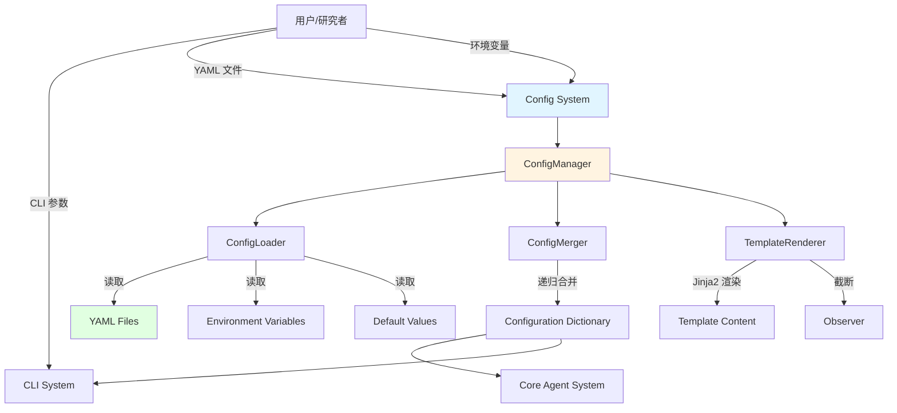
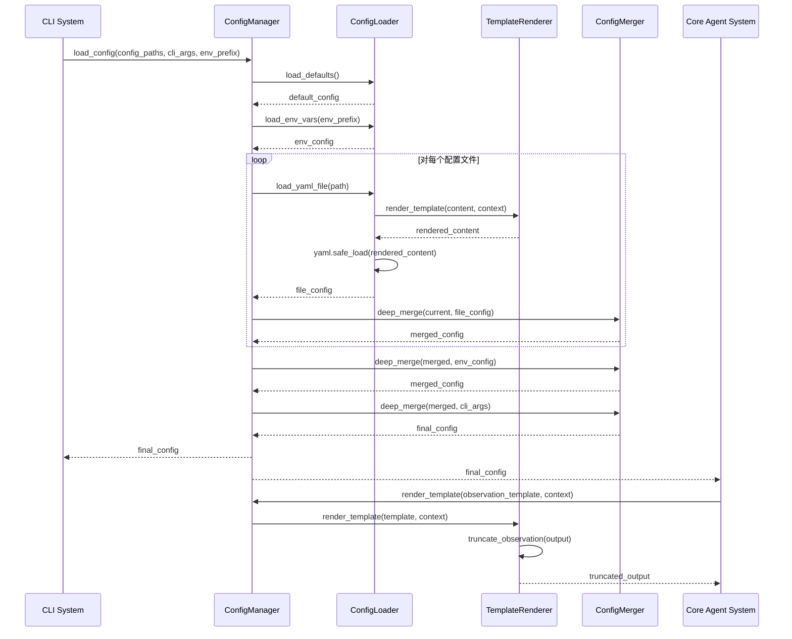
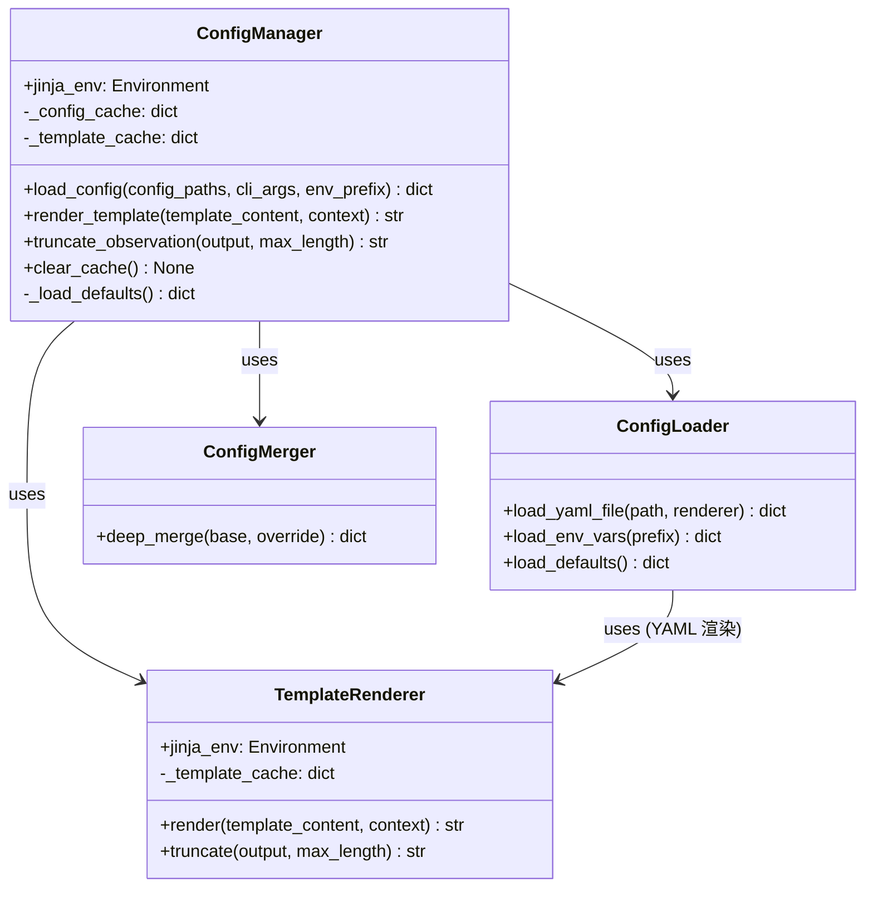

# Config System 系统设计文档 (L0 — 导航层)

| 字段          | 值                                                                    |
| ------------- | --------------------------------------------------------------------- |
| **System ID** | `config`                                                              |
| **Project**   | mini SWE Agent                                                         |
| **Version**   | 1.0                                                                   |
| **Status**    | `Draft`                                                               |
| **Author**    | Design System Agent                                                   |
| **Date**      | 2026-05-10                                                            |
| **L1 Detail** | [config.detail.md](./config.detail.md) — 仅 `/forge` 时加载           |

> [!IMPORTANT]
> **文档分层说明**
> - **本文件 (L0 导航层)**: 架构图、操作契约、设计决策。面向快速理解与任务规划。禁止放配置字典、算法伪代码和方法体。
> - **[config.detail.md](./config.detail.md) (L1 实现层)**: 完整伪代码、配置常量、边缘情况。仅 `/forge` 任务明确引用时加载。
> - **L1 锚点原则**: L1 中的每一节都必须在本文件有对应超链接入口。严禁 L1 出现 L0 完全未提及的"孤岛内容"。

---

## 目录 (Table of Contents)

|   §   | 章节                                                         | 关键内容                                                 |
| :---: | ------------------------------------------------------------ | -------------------------------------------------------- |
|   1   | [概览](#1-概览-overview)                                     | 系统目的、边界、职责                                     |
|   2   | [目标与非目标](#2-目标与非目标-goals--non-goals)             | Goals / Non-Goals                                        |
|   3   | [背景与上下文](#3-背景与上下文-background--context)          | 为什么需要这个系统、约束                                 |
|   4   | [系统架构](#4-系统架构-architecture)                         | Mermaid 架构图、组件职责、数据流                         |
|   5   | [接口设计](#5-接口设计-interface-design)                     | 操作契约表、跨系统协议                                   |
|   6   | [数据模型](#6-数据模型-data-model)                           | 实体字段声明 → [L1 §1-2](./config.detail.md)              |
|   7   | [技术选型](#7-技术选型-technology-stack)                     | 核心技术、关键依赖                                       |
|   8   | [Trade-offs](#8-trade-offs--alternatives-权衡与备选方案)     | 决策理由、备选方案对比                                   |
|   9   | [安全性考虑](#9-安全性考虑-security-considerations)          | 认证授权、风险与缓解                                     |
|   10   | [性能考虑](#10-性能考虑-performance-considerations)          | 性能目标、优化策略                                       |
|   11   | [测试策略](#11-测试策略-testing-strategy)                    | 单测、集成、性能测试                                     |
|   12   | [部署与运维](#12-部署与运维-deployment--operations) *(可选)* | 流程、监控、可观测性                                     |
|   13   | [未来考虑](#13-未来考虑-future-considerations) *(可选)*      | 扩展性、技术债                                           |
|   14   | [附录](#14-appendix-附录) *(可选)*                           | 术语表、参考资料、变更日志                               |

**L1 实现层** → [config.detail.md](./config.detail.md)（仅 `/forge` 时加载）
> [§1 配置常量](./config.detail.md) · [§2 数据结构](./config.detail.md) · [§3 算法](./config.detail.md) · [§4 决策树](./config.detail.md) · [§5 边缘情况](./config.detail.md)

---

## 1. 概览 (Overview)

### 1.1 System Purpose (系统目的)

Config System 是 mini SWE Agent 的配置管理基础设施，负责统一加载、合并、渲染和验证配置，为核心 Agent System 和 CLI System 提供配置服务。它支持多源配置分层加载、Jinja2 模板渲染、观测内容截断，确保配置管理的灵活性、可维护性和安全性。

### 1.2 System Boundary (系统边界)

- **输入 (Input)**:
  - CLI 参数（`--config file.yaml`, `--key value`）
  - YAML 配置文件（可多个，支持递归合并）
  - 环境变量（用于密钥等敏感信息）
  - 代码中定义的默认值
  - 观测模板（用于格式化执行结果）

- **输出 (Output)**:
  - 合并后的配置对象（Dict[str, Any]）
  - 渲染并截断后的观测内容（str）

- **依赖系统 (Dependencies)**:
  - 外部库：pyyaml（YAML 解析）、jinja2（模板渲染）

- **被依赖系统 (Dependents)**:
  - CLI System（调用 Config System 加载配置后，将配置对象传递给 Core Agent System）
  - （Core Agent System 不再直接调用 Config System，配置由 CLI System 统一加载并传入）

### 1.3 System Responsibilities (系统职责)

**负责**:
- 多源配置的分层加载与递归合并
- YAML 配置文件的解析与 Jinja2 模板渲染
- 配置优先级管理（CLI > 文件 > 环境变量 > 默认值）
- 观测模板的渲染与截断（根据 ADR-004）
- 配置验证与错误处理（提供清晰的错误信息）

**不负责**:
- 具体的业务逻辑（由 Core Agent 和 CLI 系统负责）
- 模型 API 调用（由 Model Adapter 负责）
- Shell 命令执行（由 Executor 负责）
- 配置的持久化存储（配置文件由用户管理）

---

## 2. 目标与非目标 (Goals & Non-Goals)

### 2.1 Goals

- **[G1]**: 实现多源配置的分层加载与递归合并，支持 CLI 参数 > 配置文件 > 环境变量 > 默认值的优先级
- **[G2]**: 支持 YAML + Jinja2 模板渲染，使用 StrictUndefined 模式捕获未定义变量
- **[G3]**: 实现观测模板截断功能（>= 10000 字符时截断为前 5000 + 后 5000）
- **[G4]**: 提供清晰的配置错误信息，帮助用户快速诊断问题
- **[G5]**: 配置加载性能良好，不阻塞主流程启动

### 2.2 Non-Goals

- **[NG1]**: 提供配置的持久化存储或版本管理（配置文件由用户管理）
- **[NG2]**: 支持配置的热更新或运行时重新加载（仅在启动时加载）
- **[NG3]**: 提供复杂的配置验证框架（如 JSON Schema、Pydantic），仅做简单验证
- **[NG4]**: 支持跨文件的变量引用（模板渲染在每个文件内独立进行）

---

## 3. 背景与上下文 (Background & Context)

### 3.1 Why This System? (为什么需要这个系统？)

在 mini SWE Agent 中，Core Agent System 和 CLI System 都需要访问配置，包括模型 API 密钥、执行参数、批处理设置等。如果没有统一的配置管理系统，每个系统都需要自己实现配置加载逻辑，导致代码重复、维护困难。此外，配置需要支持多源加载（CLI、文件、环境变量）、模板渲染（提高配置复用性）和观测内容截断（避免轨迹文件过大），这些功能需要一个专门的系统来提供。

**关联PRD需求**: [REQ-007] 配置管理

### 3.2 Current State (现状分析)

当前项目尚未实现配置管理系统，配置管理功能是待开发状态。

### 3.3 Constraints (约束条件)

- **技术约束**: 必须使用 Python 3.10+，依赖 pyyaml 和 jinja2（ADR-001）
- **性能约束**: 配置加载应快速，不阻塞主流程启动
- **安全约束**: 禁止硬编码密钥、必须使用 yaml.safe_load()、StrictUndefined 模式、敏感信息过滤（ADR-004）
- **资源约束**: 不引入额外依赖（如 Pydantic、python-anyconfig），保持轻量级

---

## 4. 系统架构 (Architecture)

### 4.1 Architecture Diagram (架构图)



### 4.2 Core Components (核心组件)

| Component Name | Responsibility | Tech Stack | Notes |
| -------------- | -------------- | ---------- | ----- |
| ConfigManager | 统一配置管理入口，协调各组件 | Python 3.10+ | 提供 load_config、render_template、truncate_observation 等方法 |
| ConfigLoader | 从不同源加载配置（文件、环境变量、默认值） | pyyaml, os.environ | 支持 YAML 解析、环境变量读取 |
| ConfigMerger | 递归合并配置字典 | Python dict 操作 | 字典递归合并，列表覆盖 |
| TemplateRenderer | Jinja2 模板渲染与观测内容截断 | jinja2 | StrictUndefined 模式，trim_blocks, lstrip_blocks |

### 4.3 Data Flow (数据流)



**关键数据流说明**:
1. **配置加载流程**: 按优先级从低到高依次加载（默认值 → 环境变量 → 配置文件 → CLI 参数），每加载一个源就进行一次递归合并
2. **模板渲染流程**: 在加载 YAML 文件时，先进行 Jinja2 渲染，再解析 YAML；观测模板在运行时渲染并截断
3. **合并策略**: 字典递归合并（保留两边键），列表直接覆盖

---

## 5. 接口设计 (Interface Design)

### 5.1 操作契约表 (Operation Contracts)

| 操作 | [REQ-XXX] | 前置条件 | 消耗/输入 | 产出/副作用 | 实现细节 |
| --- | :---: | --- | --- | --- | :---: |
| `load_config(config_paths, cli_args, env_prefix)` | [REQ-007] | config_paths 为空列表或有效文件路径；cli_args 为字典或 None | 文件 I/O、内存 | 返回合并后的配置字典；副作用：读取文件、环境变量 | [§3.1](./config.detail.md) |
| `render_template(template_content, context)` | [REQ-007] | template_content 为非空字符串；context 为字典 | CPU、内存 | 返回渲染后的字符串；可能抛 ConfigError (UndefinedError / SyntaxError) | [§3.2](./config.detail.md) |
| `truncate_observation(output, max_length)` | [REQ-007] | output 为字符串；max_length 为正整数 | CPU、内存 | 返回截断后的字符串；副作用：若截断则记录 warning | [§3.3](./config.detail.md) |
| `deep_merge(base, override)` | [REQ-007] | base 和 override 均为 dict 或 None | CPU、内存 | 返回合并后的新字典；无副作用 | [§3.4](./config.detail.md) |

### 5.2 跨系统接口协议 (Cross-System Interface)

Config System 通过 `IConfigManager` Protocol 向 Core Agent System 和 CLI System 暴露能力：

```python
from typing import Protocol, Any

class IConfigManager(Protocol):
    def load_config(
        self,
        config_paths: list[str] | None,
        cli_args: dict[str, Any] | None,
        env_prefix: str | None,
    ) -> dict[str, Any]: ...

    def render_template(
        self,
        template_content: str,
        context: dict[str, Any],
    ) -> str:
        """
        Raises:
            ConfigError: 模板包含未定义变量（StrictUndefined）或语法错误时。
                ConfigError 包含 file_path、line、variable 属性，便于诊断。
        """
        ...

    def truncate_observation(
        self,
        output: str,
        max_length: int | None = None,
    ) -> str:
        """
        max_length 默认从配置中读取 `truncate_observation_threshold`（默认 10000）。
        可通过配置文件或 CLI 参数覆盖。
        """
        ...
```

### 5.3 HTTP API 端点摘要

Config System 是纯 Python 模块，无 HTTP API，本节不适用。

---

## 6. 数据模型 (Data Model)

### 6.1 核心实体 (Core Entities)

Config System 的核心实体为四个协作类，只放属性字段 + 方法签名：

```python
# ── ConfigManager ──────────────────────────────────────────
class ConfigManager:
    jinja_env: jinja2.Environment
    _config_cache: dict[str, Any]
    _template_cache: dict[str, jinja2.Template]
    _defaults: dict[str, Any]  # 包含 truncate_observation_threshold=10000 等默认值

    def load_config(
        self,
        config_paths: list[str] | None,
        cli_args: dict[str, Any] | None,
        env_prefix: str | None,
    ) -> dict[str, Any]: ...

    def render_template(self, template_content: str, context: dict[str, Any]) -> str: ...
    def truncate_observation(self, output: str, max_length: int = 10000) -> str: ...
    def clear_cache(self) -> None: ...
    def _load_defaults(self) -> dict[str, Any]: ...


# ── ConfigLoader ───────────────────────────────────────────
class ConfigLoader:
    def load_yaml_file(self, path: str, renderer: "TemplateRenderer") -> dict[str, Any]: ...
    def load_env_vars(self, prefix: str) -> dict[str, Any]: ...
    def load_defaults(self) -> dict[str, Any]: ...


# ── ConfigMerger ───────────────────────────────────────────
class ConfigMerger:
    def deep_merge(self, base: dict[str, Any] | None, override: dict[str, Any] | None) -> dict[str, Any]: ...


# ── TemplateRenderer ───────────────────────────────────────
class TemplateRenderer:
    jinja_env: jinja2.Environment
    _template_cache: dict[str, jinja2.Template]

    def render(self, template_content: str, context: dict[str, Any]) -> str: ...
    def truncate(self, output: str, max_length: int = 10000) -> str: ...
```

*(完整方法实现 → [L1 §2](./config.detail.md) · 配置常量字典 → [L1 §1](./config.detail.md))*

### 6.2 组件关系图 (Component Relationship)



### 6.3 数据流向 (Data Flow Direction)

配置数据在系统内的流向为单向只读：

1. **加载阶段**（启动时一次性）：多源原始数据 → ConfigLoader → ConfigMerger → 合并后 `dict`，缓存在 ConfigManager
2. **消费阶段**（运行时只读）：Core Agent System / CLI System 调用 `load_config()` 获取配置副本，**不允许回写**
3. **渲染阶段**（运行时按需）：Observer 将观测内容传入 `render_template()` + `truncate_observation()`，结果字符串直接传回，不持久化

---

## 7. 技术选型 (Technology Stack)

### 7.1 核心技术

| 技术 | 版本 | 用途 | 理由 |
| ---- | ---- | ---- | ---- |
| Python | 3.10+ | 实现语言 | ADR-001 决策，生态丰富 |
| pyyaml | Latest | YAML 解析 | ADR-001 决策，支持 safe_load |
| jinja2 | Latest | 模板渲染 | ADR-001 决策，支持 StrictUndefined |

### 7.2 关键依赖

- **pyyaml**: 用于 YAML 文件的解析和序列化
- **jinja2**: 用于模板渲染，支持变量替换、条件判断、循环等

---

## 8. Trade-offs & Alternatives (权衡与备选方案)

### 8.1 配置优先级与合并策略（跨系统决策 — 引用 ADR）

> **决策来源**: [ADR-004: 配置管理策略](../03_ADR/ADR_004_CONFIG_MANAGEMENT.md)
>
> 本系统实现 ADR-004 定义的优先级（CLI > 文件 > 环境变量 > 默认值）与"字典递归合并，列表覆盖"策略，不在此重复决策理由。
>
> **本系统特有实现**: 以 `deep_merge(base, override)` 迭代合并，每加载一个源立即合并入累积结果，保证优先级在合并循环中顺序正确。

### 8.2 模板渲染时机（本系统特有决策）

**Option A: 逐文件渲染（Selected）**
- **优点**: 实现简单；每个文件在加载时独立完成渲染，上下文清晰，无跨文件依赖风险
- **缺点**: 无法跨文件共享 Jinja2 变量

**Option B: 批量渲染（所有文件加载后统一渲染）**
- **优点**: 可跨文件共享变量
- **缺点**: 实现复杂；需要两遍扫描；可能引入循环引用

**Decision**: 选择 Option A，因为 [NG4] 明确不支持跨文件变量引用，逐文件渲染复杂度最低且完全满足需求。

### 8.3 配置验证策略（本系统特有决策）

**Option A: 最小化验证（Selected）**
- **优点**: 零额外依赖；保持轻量级；运行时尽早抛出，调用方可自行处理
- **缺点**: 无法在加载阶段进行字段范围/类型约束校验

**Option B: 引入 Pydantic 进行 Schema 验证**
- **优点**: 强类型验证、自动类型转换、清晰的错误信息
- **缺点**: 增加依赖，违反 ADR-001 技术栈约束

**Decision**: 选择 Option A，符合 ADR-001 最小依赖原则；若未来验证需求增长，可演进为 Pydantic（作为技术债记录于 §13.2）。

### 8.4 配置缓存机制（本系统特有决策）

**Option A: 进程内字典缓存（Selected）**
- **优点**: 零额外依赖；mini SWE Agent 是单进程 CLI 工具，完全够用
- **缺点**: 进程重启后缓存丢失；不支持多进程共享

**Option B: 文件/Redis 外部缓存**
- **优点**: 支持多进程共享、跨重启持久化
- **缺点**: 显著增加运维复杂度和外部依赖，超出项目规模需要

**Decision**: 选择 Option A；需显式提供 `clear_cache()` 方法，让调用方在配置文件变更后可手动失效（见 §6.1）。

---

## 9. 安全性考虑 (Security Considerations)

### 9.1 认证与授权

Config System 不涉及认证与授权，配置文件由用户管理。

### 9.2 风险与缓解

| 风险 | 影响 | 缓解措施 |
| ---- | ---- | -------- |
| YAML 代码执行漏洞 | 高 | 使用 yaml.safe_load() 而非 yaml.load() |
| 未定义变量导致静默失败 | 中 | 使用 Jinja2 StrictUndefined 模式 |
| 敏感信息泄露（密钥） | 高 | 禁止硬编码密钥，仅通过环境变量传递；日志中过滤敏感信息 |
| 配置文件注入攻击 | 中 | 限制配置文件来源，不执行用户提供的任意代码 |
| 路径遍历攻击 | 低 | 验证配置文件路径，限制在指定目录 |

---

## 10. 性能考虑 (Performance Considerations)

### 10.1 性能目标

- 配置加载时间 < 100ms（典型配置文件 < 10KB）
- 模板渲染时间 < 10ms（典型模板 < 1KB）
- 观测截断时间 < 5ms（典型输出 < 100KB）

### 10.2 优化策略

1. **延迟加载**: 配置在首次访问时加载，避免启动时加载所有配置
2. **缓存机制**: 缓存已加载的配置和渲染后的模板，避免重复读取文件和渲染
3. **模板缓存**: Jinja2 Environment 默认启用模板缓存
4. **避免过度渲染**: 仅在必要时渲染模板（如观测模板在运行时渲染）

### 10.3 性能瓶颈与监控

**主要瓶颈**:
- 文件 I/O：配置文件读取（通过 `_config_cache` 缓解，首次加载后缓存）
- 模板渲染：复杂模板较慢（通过 `_template_cache` 缓解，相同模板字符串只编译一次）

**可观测指标**（建议在集成测试中断言）:

| 指标 | 目标 | 测量方式 |
| ---- | ---- | -------- |
| 冷启动配置加载 | < 100 ms（配置文件 ≤ 10 KB） | `time.perf_counter()` |
| 单次模板渲染（缓存命中） | < 1 ms | `time.perf_counter()` |
| 观测截断（100 KB 输入） | < 5 ms | `time.perf_counter()` |

---

## 11. 测试策略 (Testing Strategy)

### 11.1 单元测试

- ConfigLoader: 测试 YAML 文件加载、环境变量读取、默认值加载
- ConfigMerger: 测试递归合并逻辑（字典合并、列表覆盖）
- TemplateRenderer: 测试 Jinja2 渲染、StrictUndefined 错误捕获、观测截断
- ConfigManager: 测试多源配置加载流程、优先级顺序

### 11.2 集成测试

- 测试完整的配置加载流程（默认值 → 环境变量 → 配置文件 → CLI 参数）
- 测试配置文件包含 Jinja2 模板的场景
- 测试观测模板渲染与截断的端到端流程

### 11.3 边缘情况测试

- 配置文件不存在
- YAML 语法错误
- Jinja2 模板语法错误
- 未定义变量（StrictUndefined）
- 空配置文件
- 配置类型不匹配

### 11.4 性能测试

- 测试大配置文件（> 1 MB）的加载性能
- 测试复杂模板的渲染性能（缓存命中 vs 未命中）

### 11.5 契约-验证责任矩阵 (Contract Verification Matrix)

| 契约 | 风险级别 | 正常态验证 | 失败态验证 | 回归责任 |
| ---- | :------: | ---------- | ---------- | -------- |
| `load_config` 优先级顺序（CLI > 文件 > ENV > 默认值） | 关键路径 | 集成测试：多源覆盖同一键，断言最终值来自最高优先级 | 文件缺失抛 FileNotFoundError；YAML 语法错误抛 ConfigError | 配置加载主链路最小回归 |
| `render_template` StrictUndefined 行为 | 基础规则层 | 单元测试：含所有变量的模板正常渲染 | 未定义变量抛 ConfigError（含变量名） | 模板渲染回归 |
| `truncate_observation` 截断语义（>= 10000 则截断） | 基础规则层 | 单元测试：9999 字符不截断；10000 字符截断为前 5000 + 后 5000 | max_length <= 0 抛 ValueError | 截断行为回归 |
| `deep_merge` 字典递归 / 列表覆盖 | 基础规则层 | 单元测试：嵌套 dict 递归合并；list 完全覆盖 | None 输入返回另一侧（不崩溃） | 合并行为回归 |

---

## 12. 部署与运维 (Deployment & Operations) *(可选)*

Config System 作为 Python 模块部署，无需特殊运维。

### 12.1 部署流程

1. 将 `src/config/` 目录打包为 Python 包
2. 通过 pyproject.toml 定义依赖（pyyaml, jinja2）
3. 使用 pip 安装

### 12.2 监控与可观测性

- 记录配置加载日志（包括加载的文件、合并的配置）
- 记录模板渲染错误（UndefinedError、SyntaxError）
- 记录观测截断警告（当输出被截断时）

### 12.3 配置管理

- 配置文件由用户管理，不纳入版本控制（除了示例配置）
- 提供配置文件模板（config.example.yaml）
- 文档化配置选项和优先级

---

## 13. 未来考虑 (Future Considerations)

### 13.1 扩展性

- 支持更多配置格式（JSON、TOML）
- 支持配置文件包含（include 其他配置文件）
- 支持配置验证 Schema（如 JSON Schema）
- 支持配置热更新（运行时重新加载）

### 13.2 技术债

- 当前实现不支持跨文件变量引用，未来可能需要
- 当前验证能力较弱，未来可能需要引入 Pydantic
- 当前不支持配置版本管理，未来可能需要

---

## 14. 附录 (Appendix)

### 14.1 术语表

| 术语 | 定义 |
| ---- | ---- |
| 递归合并 | 字典类型递归合并，保留两边的键；非字典类型直接覆盖 |
| StrictUndefined | Jinja2 的 undefined 类型，禁止未定义变量的任何操作（除了检查是否定义） |
| 观测截断 | 当观测内容超过最大长度时，截断为前 N + 后 M 字符 |

### 14.2 参考资料

- [ADR-001: 技术栈选择](../03_ADR/ADR_001_TECH_STACK.md)
- [ADR-004: 配置管理策略](../03_ADR/ADR_004_CONFIG_MANAGEMENT.md)
- [PyYAML Documentation](http://pyyaml.org/wiki/PyYAMLDocumentation)
- [Jinja2 Documentation](https://jinja.palletsprojects.com/)

### 14.3 变更日志

| 版本 | 日期 | 作者 | 变更内容 |
| ---- | ---- | ---- | -------- |
| 1.0 | 2026-05-10 | Design System Agent | 初始版本 |