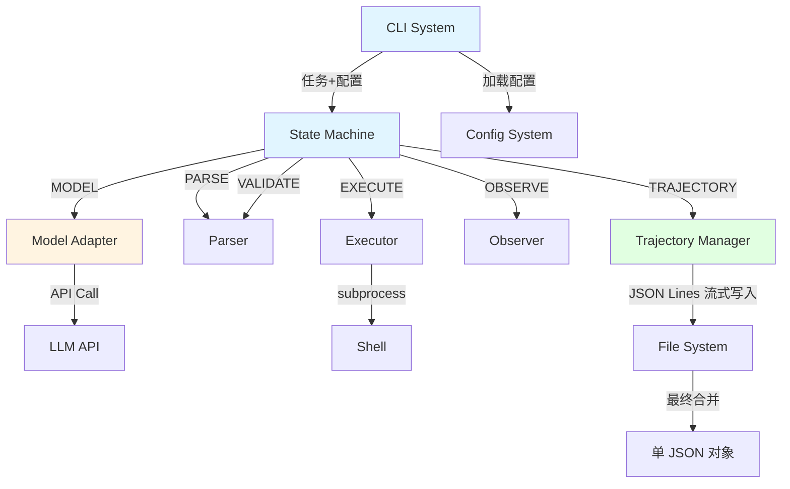
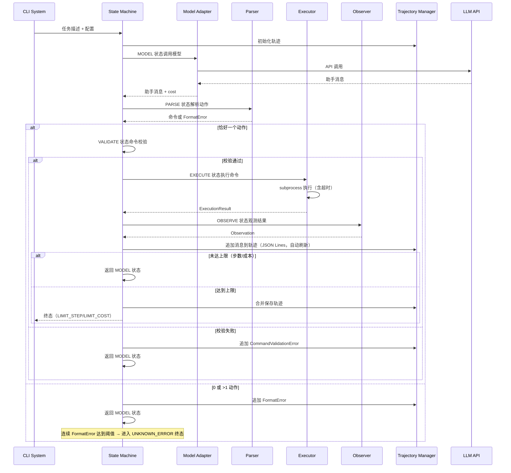

# Core Agent System 系统设计文档 (L0 — 导航层)

| 字段          | 值                                                                    |
| ------------- | --------------------------------------------------------------------- |
| **System ID** | `core-agent`                                                         |
| **Project**   | mini SWE Agent                                                        |
| **Version**   | 1.0                                                                   |
| **Status**    | `Draft`                                                               |
| **Author**    | System Designer Agent                                                |
| **Date**      | 2026-05-10                                                          |
| **L1 Detail** | [core-agent.detail.md](./core-agent.detail.md) — 仅 `/forge` 时加载 |

> [!IMPORTANT]
> **文档分层说明**
> - **本文件 (L0 导航层)**: 架构图、操作契约、设计决策。面向快速理解与任务规划。禁止放配置字典、算法伪代码和方法体。
> - **[core-agent.detail.md](./core-agent.detail.md) (L1 实现层)**: 完整伪代码、配置常量、边缘情况。仅 `/forge` 任务明确引用时加载。
> - **L1 锚点原则**: L1 中的每一节都必须在本文件有对应超链接入口。严禁 L1 出现 L0 完全未提及的"孤岛内容"。

---

## 目录 (Table of Contents)

|   §   | 章节                                                         | 关键内容                                                 |
| :---: | ------------------------------------------------------------ | -------------------------------------------------------- |
|   1   | [概览](#1-概览-overview)                                     | 系统目的、边界、职责                                     |
|   2   | [目标与非目标](#2-目标与非目标-goals--non-goals)             | Goals / Non-Goals                                        |
|   3   | [背景与上下文](#3-背景与上下文-background--context)          | 为什么需要这个系统、约束                                 |
|   4   | [系统架构](#4-系统架构-architecture)                         | Mermaid 架构图、组件职责、数据流                         |
|   5   | [接口设计](#5-接口设计-interface-design)                     | 操作契约表、跨系统协议                                   |
|   6   | [数据模型](#6-数据模型-data-model)                           | 实体字段声明 → [L1 §2](./core-agent.detail.md)           |
|   7   | [技术选型](#7-技术选型-technology-stack)                     | 核心技术、关键依赖                                       |
|   8   | [Trade-offs](#8-trade-offs--alternatives-权衡与备选方案)     | 决策理由、备选方案对比                                   |
|   9   | [安全性考虑](#9-安全性考虑-security-considerations)          | 认证授权、风险与缓解                                     |
|   10   | [性能考虑](#10-性能考虑-performance-considerations)          | 性能目标、优化策略                                       |
|   11   | [测试策略](#11-测试策略-testing-strategy)                    | 单测、集成、性能测试                                     |
|   12   | [部署与运维](#12-部署与运维-deployment--operations) *(可选)* | 流程、监控、可观测性                                     |
|   13   | [未来考虑](#13-未来考虑-future-considerations) *(可选)*      | 扩展性、技术债                                           |
|   14   | [附录](#14-appendix-附录) *(可选)*                           | 术语表、参考资料、变更日志                               |

**L1 实现层** → [core-agent.detail.md](./core-agent.detail.md)（仅 `/forge` 时加载）
> [§1 配置常量](./core-agent.detail.md) · [§2 数据结构](./core-agent.detail.md) · [§3 算法](./core-agent.detail.md) · [§4 决策树](./core-agent.detail.md) · [§5 边缘情况](./core-agent.detail.md)

---

## 1. 概览 (Overview)

### 1.1 System Purpose (系统目的)
实现 MODEL → PARSE → EXECUTE → OBSERVE 状态机闭环，协调内部组件完成自动化 Shell 命令执行，支持严格动作协议、提交标记契约和完整轨迹记录，为研究者提供可复现、可审计的自动化编程任务执行框架。

### 1.2 System Boundary (系统边界)

- **输入 (Input)**:
  - 任务描述（来自 CLI System）
  - 配置（来自 CLI System，已由 Config System 渲染合并）
  - 用户确认（confirm 模式下的 y/n 输入）

- **输出 (Output)**:
  - 执行结果（stdout/stderr/returncode）
  - 轨迹 JSON（写入文件系统）
  - 终态（SUBMITTED/LIMIT_STEP/LIMIT_COST/INTERRUPT/FATAL_CONFIG/UNKNOWN_ERROR）

- **依赖系统 (Dependencies)**:
  - LLM API（通过 Model Adapter 调用）
  - （配置由 CLI System 加载后传入，Core Agent 不再直接调用 Config System）

- **被依赖系统 (Dependents)**:
  - CLI System（调用执行）

### 1.3 System Responsibilities (系统职责)

**负责**:
- 核心状态机闭环（MODEL → PARSE → VALIDATE → EXECUTE → OBSERVE），含 FormatError 防循环机制
- 动作解析（严格协议：恰好一个动作）
- 命令校验（安全基线：黑名单/危险标志检查）
- subprocess 执行（本机、超时控制）
- 结果观测（提交标记检测）
- 模型 API 适配（tool-call / 文本模式切换，含 token-based 成本估算）
- 轨迹记录（JSON Lines 格式写入 + 最终合并为单 JSON 对象，schema_version v1_jsonl）
- 终态处理（6 种终态：SUBMITTED、LIMIT_STEP、LIMIT_COST、INTERRUPT、FATAL_CONFIG、UNKNOWN_ERROR）
- 配置加载失败时：CLI 层捕获 ConfigError 并写入最小化诊断文件，Core Agent 不启动（CH-R2-02）

**内部组件定位**:
- Parser、Executor、Observer、Model Adapter、Trajectory Manager 是 Core Agent 的**内部实现细节**，不跨越系统边界
- 它们仅在架构图中用虚线表示，不作为独立子系统对外暴露接口
- 接口设计（§5）仅定义 Core Agent 的对外契约，内部组件的具体实现在 L1 detail.md 中定义

**不负责**:
- 配置管理（由 Config System 负责）
- CLI 参数解析（由 CLI System 负责）
- 批处理并发（由 CLI System 负责）
- Textual 检查器（由 CLI System 负责）

---

## 2. 目标与非目标 (Goals & Non-Goals)

### 2.1 Goals

- **[G1]**: 实现严格的状态机闭环，每步可审计
- **[G2]**: 支持恰好一个动作协议，0 或 >1 动作抛 FormatError
- **[G3]**: 本机 subprocess 执行，超时控制（默认 120 秒）
- **[G4]**: 提交标记严格检测（COMPLETE_TASK_AND_SUBMIT_FINAL_OUTPUT + returncode==0）
- **[G5]**: 支持 tool-call / 文本模式切换
- **[G6]**: 完整轨迹记录（JSON Lines 流式写入 + 最终合并为单 JSON 对象，schema_version v1_jsonl）
- **[G7]**: 终态处理（6 种终态，中断时尽力保存轨迹）

### 2.2 Non-Goals

- **[NG1]**: 规定内部包名、目录结构等实现细节
- **[NG2]**: 支持远程执行服务（仅本机 subprocess）
- **[NG3]**: 支持轨迹编辑或回滚重新执行（仅查看）
- **[NG4]**: 实现复杂的任务依赖编排（单任务闭环）

---

## 3. 背景与上下文 (Background & Context)

### 3.1 Why This System? (为什么需要这个系统？)
研究者需要一个可复现的自动化编程任务执行框架。现有的 agent 实现要么行为不可预测（静默选择动作），要么缺少轨迹记录（无法分析失败原因），要么不支持批量评估（无法做 benchmark）。本系统通过严格状态机闭环、完整轨迹记录和标准化接口，为 SWE benchmark 和研究提供可复现的基础设施。

**关联PRD需求**: [REQ-001] 核心状态机闭环, [REQ-002] 严格动作协议, [REQ-003] 本机执行, [REQ-004] 提交标记契约, [REQ-005] 模型适配, [REQ-006] 轨迹记录

### 3.2 Current State (现状分析)
当前没有现有实现，这是一个全新系统。设计参考了业界最佳实践：
- 状态机实现：State Pattern + 运行到完成（RTC）模型
- 错误处理：指数退避 + 抖动重试
- subprocess 安全：避免 shell=True，参数化传递
- 轨迹存储：单 JSON 对象，增量写入，最终合并

### 3.3 Constraints (约束条件)

- **技术约束**: Python 3.10+（ADR-001）
- **性能约束**: 单步超时 120 秒（可配置）
- **安全约束**: 禁止硬编码密钥、CLI --help 必须警示 Shell 执行风险
- **资源约束**: 轨迹 JSON 采用流式写入（JSON Lines，每步一行），最终合并为单 JSON 对象。默认每 100 步自动刷新到临时文件，防止 OOM

---

## 4. 系统架构 (Architecture)

### 4.1 Architecture Diagram (架构图)



### 4.2 Core Components (核心组件)

| Component Name | Responsibility | Tech Stack | Notes |
| -------------- | -------------- | ---------- | ----- |
| State Machine | 状态机闭环、状态转换逻辑、防循环保护 | Python 3.10+ | State Pattern + FormatError 计数器 |
| Parser | 动作解析（tool-call / 文本模式） | Python 3.10+ | 恰好一个动作检测 |
| Executor | subprocess 执行、超时控制 | subprocess | 列表形式参数，超时 120s |
| Observer | 结果观测、提交标记检测（ANSI/Unicode 鲁棒） | Python 3.10+ | returncode 检查 |
| Model Adapter | 模型 API 调用、协议切换、成本计费 | litellm, tenacity | 指数退避重试 + token-based 成本估算 |
| Trajectory Manager | 轨迹记录、JSON Lines 流式写入、最终合并 | json | schema version v1_jsonl，每 100 步自动刷新 |

### 4.3 Data Flow (数据流)



**关键数据流说明**:
1. **MODEL 状态**: 调用 Model Adapter，获取助手消息和 cost
2. **PARSE 状态**: Parser 解析动作，恰好一个动作继续，否则抛 FormatError
3. **EXECUTE 状态**: Executor 使用 subprocess 执行命令，捕获 returncode/stdout/stderr
4. **OBSERVE 状态**: Observer 检测提交标记，判断是否进入 SUBMITTED 终态
5. **轨迹记录**: Trajectory Manager 增量追加消息，最终保存为单 JSON 对象

> **完整状态机逻辑详见 [L1 §4 决策树](./core-agent.detail.md)**

### 4.4 State Transition Table (状态转换表)

| 当前状态 | 触发条件 | 下一状态 | 备注 |
|---------|---------|---------|------|
| MODEL | 模型生成助手消息 | PARSE | - |
| PARSE | 恰好一个动作 + yolo 模式 | EXECUTE | 直接执行 |
| PARSE | 恰好一个动作 + confirm 模式 + 用户确认 y | EXECUTE | 用户确认后执行 |
| PARSE | 恰好一个动作 + confirm 模式 + 用户确认 n | INTERRUPT | 用户拒绝 |
| PARSE | 0 或 >1 动作 | MODEL | 抛 FormatError |
| EXECUTE | 命令执行完成 | OBSERVE | - |
| EXECUTE | 执行超时 | OBSERVE | 记录超时错误 |
| OBSERVE | 提交标记匹配 + returncode==0 | SUBMITTED | 进入终态，停止循环 |
| OBSERVE | 提交标记不匹配 或 returncode!=0 | MODEL / LIMIT_STEP / LIMIT_COST | 在 OBSERVE 状态内检查上限后分支 |
| 任意状态 | 连续 FormatError >= max（默认 5） | UNKNOWN_ERROR | 防循环保护，保存轨迹 |
| 任意状态 | 用户中断（SIGINT） | INTERRUPT | 信号处理器 + 临时文件恢复 |
| 任意状态 | 配置错误 | FATAL_CONFIG | 立即终止，不执行任何操作 |

### 4.5 Interruption Handling (中断处理)

**中断信号**: SIGINT（Ctrl+C）、SIGTERM

**中断处理流程**:
1. 注册 `signal.signal(signal.SIGINT, handler)` 和 `SIGTERM` 处理器
2. 处理器收到信号后：
   - 立即停止当前操作（subprocess 执行发送 SIGKILL；模型 API 调用取消）
   - 调用 `trajectory_manager.save(timeout=5)`（5 秒超时，防止保存操作卡住）
   - 若保存成功，正常进入 INTERRUPT 终态
   - 若保存失败或超时，保留 `.trajectory.tmp.jsonl` 临时文件用于恢复
3. 返回退出码 130（SIGINT 标准退出码）

**自动保存机制**:
- 每完成 100 步，Trajectory Manager 自动将已累积的消息刷新到 `.trajectory.tmp.jsonl`
- 正常退出时删除临时文件
- 进程异常退出时，临时文件保留，可用于 `--recover-trajectory` 恢复

**中断时的状态保证**:
- 轨迹尽力保存（信号处理器 + 临时文件双保险）
- subprocess 进程立即终止，不等待
- 模型 API 调用取消（如支持）

---

## 5. 接口设计 (Interface Design)

### 5.1 操作契约表 (Operation Contracts)

| 操作 | [REQ-XXX] | 前置条件 | 消耗/输入 | 产出/副作用 | 实现细节 |
| --- | :---: | --- | --- | --- | :---: |
| `parse_action(message, protocol)` | [REQ-002] | 消息格式正确; 命令非空 | 消息内容 | 命令字符串或 FormatError | [L1 §3.1](./core-agent.detail.md) |
| `validate_command(command)` | [REQ-003] | 命令非空 | 命令字符串 | 通过 或 CommandValidationError | [L1 §3.1b](./core-agent.detail.md) |
| `execute_command(command, timeout, cwd)` | [REQ-003] | 校验通过 | 命令字符串 | ExecutionResult | [L1 §3.2](./core-agent.detail.md) |
| `observe_result(result)` | [REQ-004] | ExecutionResult 有效 | 执行结果 | Observation | [L1 §3.3](./core-agent.detail.md) |
| `call_model(messages, config)` | [REQ-005] | 配置有效 | 消息历史 | ModelResponse | [L1 §3.4](./core-agent.detail.md) |
| `check_cost_limit(cost_acc, cost_limit)` | [REQ-005] | 成本已累加 | 当前成本 | 超限 或 继续 | [L1 §3.4b](./core-agent.detail.md) |
| `append_to_trajectory(trajectory, message)` | [REQ-006] | 轨迹已初始化 | 消息内容 | 更新后的轨迹 | [L1 §3.5](./core-agent.detail.md) |
| `check_submission(observation)` | [REQ-004] | Observation 有效 | 观测结果 | submitted 布尔值 | [L1 §3.6](./core-agent.detail.md) |

> **填写说明**:
> - **操作**: 使用函数签名风格，参数只写关键入参类型，不写类型注解
> - **前置条件**: 简洁列举，以「;」分隔，不超过 3 个
> - **产出/副作用**: 描述状态变化
> - **实现细节**: 链接到 `.detail.md` 对应章节（如尚未创建，填「待补充」）

### 5.2 跨系统接口协议 (Cross-System Interface)

```python
# 与 Config System 的接口（由 CLI System 传入已加载的配置对象）
class ConfigProvider(Protocol):
    def get_config(self) -> dict:
        """获取合并后的配置"""
        ...

    def render_observation(self, result: ExecutionResult) -> str:
        """
        渲染观测模板
        
        职责: 从配置中获取 observation_template，使用 result 作为上下文渲染（Jinja2 StrictUndefined）
        实现: 由 Config System 提供（ADR-004 定义）
        
        Raises:
            ConfigError: 模板渲染失败时（含文件名、行号、变量名）
        
        降级策略: Core Agent 捕获 ConfigError 后返回原始 stdout/stderr（不中断任务）
        """
        ...

# 与 CLI System 的接口
class AgentRunner(Protocol):
    def run_task(
        self,
        task_description: TaskDescription,
        config: dict,
        output_dir: Path | None = None,
    ) -> AgentResult:
        """
        执行单个任务并返回完整结果。
        由 CLI System（main.py / batch.py）同步调用。
        
        异常处理策略: Core Agent 内部所有异常均被捕获，通过 AgentResult 传递，不抛异常到 CLI 层。
        """
        ...

@dataclass
class AgentResult:
    trajectory_path: Path      # 轨迹 JSON 路径（返回时已完整写入，即使失败）
    final_state: str           # SUBMITTED / LIMIT_STEP / LIMIT_COST / INTERRUPT / FATAL_CONFIG / UNKNOWN_ERROR
    overall_output: str | None # 最终提交内容（仅 SUBMITTED 时非 None）
    returncode: int            # 0 = 成功终态，1 = 失败/异常终态
    model_name: str            # 模型名称（用于 preds.json 的 model_name_or_path）
    error: str | None          # 仅当 final_state 为失败终态时非 None

# 内部观测钩子（不面向 CLI System）
class ExecutionCallback(Protocol):
    def on_step_complete(self, step: int, observation: Observation) -> None:
        """每步完成时的内部回调，用于进度报告 / TUI 实时更新"""
        ...

    def on_terminal_state(self, state: str, trajectory_path: str) -> None:
        """进入终态时的内部回调"""
        ...
```

---

## 6. 数据模型 (Data Model)

### 6.1 核心数据结构

> 完整字段声明和方法实现详见 [L1 §2](./core-agent.detail.md) · [配置常量详见 L1 §1](./core-agent.detail.md)

```python
@dataclass
class TaskDescription:
    """任务描述（由 CLI System 构造后传入 Core Agent）"""
    problem_statement: str     # 自然语言描述或代码片段
    instance_id: str | None    # 批量评估时的实例标识（可选）
    repo_path: Path | None     # 仓库路径（可选）

@dataclass
class ExecutionResult:
    """subprocess 执行结果"""
    returncode: int
    stdout: str
    stderr: str
    exception_metadata: dict | None
    duration: float            # 执行耗时（秒）

@dataclass
class Observation:
    """观测结果"""
    content: str
    submitted: bool
    submission_text: str | None

@dataclass
class ModelResponse:
    """模型 API 响应"""
    message: dict
    cost: float
    cost_calculation_method: str  # "api" | "token_based" | "missing"
    input_tokens: int | None
    output_tokens: int | None

@dataclass
class Trajectory:
    """轨迹记录"""
    schema_version: str
    messages: list[dict]
    cost_accumulator: float
    step_counter: int
    format: str                  # "jsonl" | "single_json"
```

---

## 7. 技术选型 (Technology Stack)

### 7.1 核心技术

| 技术 | 版本 | 用途 | 参考 ADR |
| --- | --- | --- | --- |
| Python | 3.10+ | 核心语言 | ADR-001 |
| subprocess | 标准库 | Shell 命令执行 | ADR-001 |
| litellm | 最新 | 模型 API 统一接口 | ADR-001 |
| tenacity | 最新 | 重试机制（指数退避） | ADR-001, ADR-003 |
| json | 标准库 | JSON 序列化 | ADR-008 |

### 7.2 关键依赖

- **litellm**: 统一接口支持 OpenAI、Anthropic、本地模型
- **tenacity**: 装饰器风格重试，支持指数退避和自定义停止条件
- **json**: 标准库 JSON 序列化，最终保存完整轨迹对象

> **配置常量详见 [L1 §1](./core-agent.detail.md)**

---

## 8. Trade-offs (权衡与备选方案)

| 决策 | 优势 | 劣势 | 参考 ADR |
| --- | --- | --- | --- |
| State Pattern（类表示状态） | 清晰的状态封装，易于扩展 | 增加类数量 | - |
| 不引入状态机库 | 减少依赖，完全控制 | 需要手动实现转换逻辑 | - |
| Protocol 接口 | 结构化子类型，灵活 | 需要类型检查器支持 | - |
| 单 JSON 对象轨迹 | 与 ADR-008 一致 | 大文件内存占用 | ADR-008 |
| 列表形式 subprocess | 安全，避免注入 | 需要手动拆分命令 | - |
| tenacity 重试 | 指数退避 + 抖动 | 额外依赖 | ADR-003 |
| 恰好一个动作 | 行为可预测 | 可能限制灵活性 | ADR-005 |
| 提交标记严格 | 防止错误提交 | 需要模型配合 | ADR-006 |
| 消息扁平化 | 避免上下文丢失 | 增加复杂度 | ADR-007 |
| schema version | 未来兼容性 | 增加字段 | ADR-008 |

**决策来源**:
- [ADR-001: 技术栈选型](../03_ADR/ADR_001_TECH_STACK.md) - Python 3.10+、litellm、tenacity
- [ADR-003: 错误处理与重试策略](../03_ADR/ADR_003_ERROR_HANDLING.md) - 重试 5 次、不重试 FormatError
- [ADR-005: 动作解析协议](../03_ADR/ADR_005_ACTION_PARSING_PROTOCOL.md) - 恰好一个动作
- [ADR-006: 提交标记契约](../03_ADR/ADR_006_SUBMISSION_CONTRACT.md) - COMPLETE_TASK_AND_SUBMIT_FINAL_OUTPUT
- [ADR-007: 模型适配协议](../03_ADR/ADR_007_MODEL_ADAPTER_PROTOCOL.md) - tool-call/文本模式、消息扁平化
- [ADR-008: 轨迹记录格式](../03_ADR/ADR_008_TRAJECTORY_FORMAT.md) - schema_version、tool_call_id 关联

**本系统特有决策**（不在 ADR 中）:
- 状态机具体实现细节（State Pattern）
- 内部组件之间的交互协议
- 终态处理的具体实现

---

## 9. 安全性考虑 (Security Considerations)

### 9.1 认证授权
- 不涉及用户认证（CLI 工具，本地执行）
- 模型 API 密钥通过环境变量或配置文件传递（禁止硬编码）

### 9.2 风险与缓解

| 风险 | 影响 | 缓解措施 |
| --- | --- | --- |
| 命令注入攻击 | 系统被入侵 | 禁止 shell=True，使用列表形式参数 |
| 密钥泄露 | API 被滥用 | 禁止硬编码密钥，日志中脱敏 |
| 轨迹文件过大 | 内存耗尽 | 增量写入 + 最终合并 |
| Shell 执行风险 | 数据丢失 | CLI --help 必须警示 |

### 9.3 安全约束
- **禁止硬编码密钥**: 仅允许环境变量与配置文件（ADR-001）
- **CLI 警示**: --help 必须警示 Shell 执行风险
- **日志脱敏**: 不记录密钥和敏感信息

### 9.4 输入验证

**命令字符串验证**（Parser 负责）:
- 非空检查：命令字符串不能为空
- 长度限制：最大 10000 字符
- 特殊字符过滤：禁止 shell 元字符（`;`, `&`, `|`, `>`, `<`, `$`, `` ` ``, `\`）
- 路径遍历防护：禁止 `../` 和绝对路径（可选，根据配置）

**配置验证**（Config System 负责）:
- YAML 格式验证
- 模板变量 StrictUndefined 检查
- 必填字段检查

**模型输出验证**（Parser 负责）:
- 恰好一个动作检测
- tool-call 与文本冲突检测
- 命令字符串非空检查

> **边缘情况与注意事项详见 [L1 §5](./core-agent.detail.md)**

---

## 10. 性能考虑 (Performance Considerations)

### 10.1 性能目标
- 单步超时：120 秒（可配置）
- 轨迹写入：流式写入，内存使用恒定
- 重试开销：网络/API 错误最多重试 5 次

### 10.2 优化策略
- **轨迹存储**: 增量追加消息，最终保存为单 JSON 对象，避免内存爆炸
- **subprocess**: 超时控制，直接终止进程，不重试
- **模型调用**: 指数退避 + 抖动，避免 thundering herd
- **内存管理**: 轨迹 JSON 在内存中累积，大任务需要流式写入

---

## 11. 测试策略 (Testing Strategy)

### 11.1 单元测试
- Parser：0 动作、2 动作、tool+文本冲突
- Executor：超时、异常捕获
- Observer：提交标记检测
- Model Adapter：消息扁平化
- Trajectory Manager：tool_call_id 关联

### 11.2 集成测试
- 成功路径：完整闭环执行
- FormatError：抛 FormatError 后继续
- 提交失败：returncode!=0 且含标记

### 11.3 E2E 测试
- 真机/火测默认关闭
- 环境变量 `MINI_SWE_ENABLE_E2E` 启用

**参考 ADR**: [ADR-002: 测试策略与质量门禁](../03_ADR/ADR_002_TESTING_STRATEGY.md)

> **测试辅助函数详见 [L1 §6](./core-agent.detail.md)**

---

## 12. 部署与运维 (Deployment & Operations) *(可选)*

### 12.1 部署流程
- pip 安装依赖
- 配置环境变量（API 密钥）
- 验证配置（`--config-validate`）

### 12.2 监控与可观测性
- 轨迹 JSON 记录完整执行历史
- 成本计费（cost_accumulator）
- 步数统计（step_counter）

---

## 13. 未来考虑 (Future Considerations)

### 13.1 扩展性
- 支持更多模型协议（如 OpenAI Assistants API）
- 支持分布式执行（远程 subprocess）
- 支持轨迹回放和调试

### 13.2 技术债
- 状态机实现可以引入专用库（如 transitions）减少手动维护
- 轨迹存储可以支持压缩（如 gzip）
- 模型调用可以支持异步（asyncio）

---

## 14. 附录 (Appendix)

### 14.1 术语表
- **状态机闭环**: MODEL → PARSE → EXECUTE → OBSERVE 的循环
- **恰好一个动作**: Parser 必须解析到恰好一个可执行动作
- **提交标记**: COMPLETE_TASK_AND_SUBMIT_FINAL_OUTPUT
- **增量写入**: 运行时每步追加消息到 Trajectory 对象，最终序列化为单 JSON 文件
- **tool_call_id**: Tool-call 模式下工具调用的唯一标识

### 14.2 参考资料
- [ADR-001: 技术栈选型](../03_ADR/ADR_001_TECH_STACK.md)
- [ADR-002: 测试策略与质量门禁](../03_ADR/ADR_002_TESTING_STRATEGY.md)
- [ADR-003: 错误处理与重试策略](../03_ADR/ADR_003_ERROR_HANDLING.md)
- [ADR-005: 动作解析协议](../03_ADR/ADR_005_ACTION_PARSING_PROTOCOL.md)
- [ADR-006: 提交标记契约](../03_ADR/ADR_006_SUBMISSION_CONTRACT.md)
- [ADR-007: 模型适配协议](../03_ADR/ADR_007_MODEL_ADAPTER_PROTOCOL.md)
- [ADR-008: 轨迹记录格式](../03_ADR/ADR_008_TRAJECTORY_FORMAT.md)

### 14.3 变更日志

| 版本 | 日期 | Changelog |
| --- | --- | --- |
| v1.0 | 2026-05-10 | 初始版本 |
