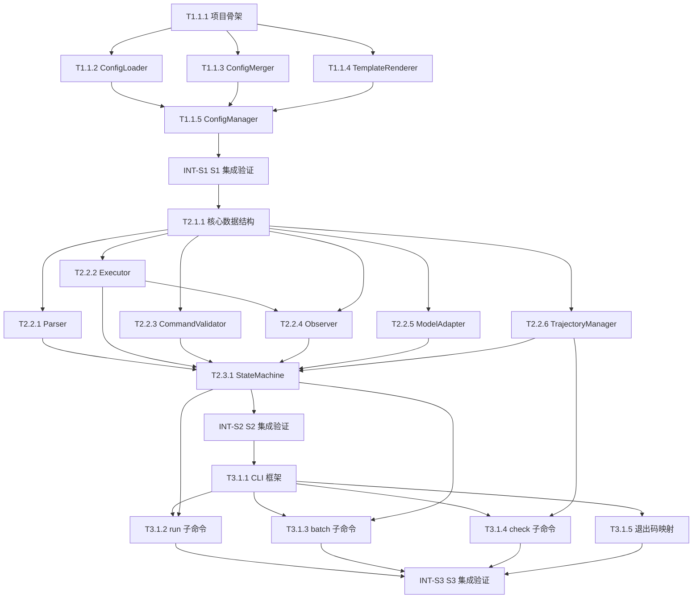

# 05A_TASKS.md — 执行主清单

> 版本: v1
> 产出自: /blueprint
> 最后更新: 2026-05-11
>
> 验证计划: [05B_VERIFICATION_PLAN.md](./05B_VERIFICATION_PLAN.md)（每个任务有对应 `验证引用`）

---

## 依赖图总览

---

## Sprint 路线图

| Sprint | 代号 | 核心任务 | 退出标准 | 预估 |
|--------|------|---------|---------|------|
| S1 | Foundation | Config System 完整实现 | `--help` 无报错；配置加载+合并单元测试通过；观测截断单元测试通过；lint/mypy 通过 | 3-4d |
| S2 | Core Engine | 状态机 + 所有内部组件 | `echo hello` 本机闭环集成测试通过；FormatError 防循环触发；提交标记+轨迹写入单元测试通过 | 5-6d |
| S3 | CLI & Polish | 三子命令 + 批处理 + 检查器 | `run` 单任务成功；`batch` preds.json schema 冒烟通过；`check` TUI 正常显示；退出码正确 | 4-5d |

---

## System 1: Config System

### Phase 1: Foundation

- [x] **T1.1.1** [基础]: 初始化项目骨架
  - **描述**: 创建标准 Python 项目目录结构，配置 pyproject.toml 依赖、ruff lint、mypy 可选类型检查
  - **输入**: `02_ARCHITECTURE_OVERVIEW.md §5 项目结构`、`ADR_001_TECH_STACK.md §技术栈`
  - **输出**: 完整目录树（`src/config/`, `src/core/`, `src/cli/`, `tests/unit/`, `tests/integration/`, `tests/e2e/`）、`pyproject.toml`、`README.md` 骨架
  - **契约承接**: 无
  - **参考**: `ADR_001_TECH_STACK.md`
  - **验收标准**:
    - Done When `pip install -e ".[dev]"` 无报错
    - Done When `ruff check src/` 无错误
    - Done When 目录树完整（`src/config/`, `src/core/`, `src/cli/`, `tests/unit/`, `tests/integration/`, `tests/e2e/`、`pyproject.toml`、`README.md` 骨架）
  - **验证类型**: 编译检查 / Lint检查
  - **验证摘要**: 验证项目初始化正确，所有依赖可安装，lint 通过；CLI `--help` 可执行性移至 T3.1.1 验收
  - **验证引用**: `05B_VERIFICATION_PLAN.md#t111`
  - **证据产出**: `logs/install.log`, `logs/lint.log`
  - **估时**: 2h
  - **依赖**: 无
  - **优先级**: P0

- [x] **T1.1.2** [REQ-007]: 实现 ConfigLoader
  - **描述**: 实现配置加载器，支持 YAML 文件（DebugUndefined 渲染后 safe_load）、环境变量（前缀转嵌套 dict）、默认值三源加载
  - **输入**: `04_SYSTEM_DESIGN/config.md §5 操作契约`、`config.detail.md §2.2 ConfigLoader`、`ADR_004_CONFIG_MANAGEMENT.md §配置源`
  - **输出**: `src/config/loader.py`（`ConfigLoader` 类）
  - **契约承接**: 配置多源加载协议（YAML/env/default 三源，DebugUndefined 模式）
  - **参考**: `ADR_004_CONFIG_MANAGEMENT.md`, `config.detail.md §2.2`
  - **验收标准**:
    - Given 合法 YAML 配置文件
    - When 调用 `load_yaml_file(path, renderer)`
    - Then 返回正确解析的 dict，含 Jinja2 变量替换结果
    - Given 文件不存在
    - When 调用 `load_yaml_file`
    - Then 抛 `FileNotFoundError`
    - Given 环境变量 `MINI_SWE_MODEL__NAME=gpt-4`
    - When 调用 `load_env_vars("MINI_SWE")`
    - Then 返回 `{"model": {"name": "gpt-4"}}`
  - **验证类型**: 单元测试
  - **验证摘要**: 覆盖 YAML 正常/语法错误/文件不存在；env 前缀转嵌套；默认值返回
  - **验证引用**: `05B_VERIFICATION_PLAN.md#t112`
  - **证据产出**: `tests/unit/test_config_loader.py`
  - **估时**: 4h
  - **依赖**: T1.1.1
  - **优先级**: P0

- [x] **T1.1.3** [REQ-007]: 实现 ConfigMerger
  - **描述**: 实现配置递归合并器，策略为 dict→递归合并，其余类型（含 list）→ override 覆盖 base，体现 CLI > 文件 > env > 默认值优先级
  - **输入**: `04_SYSTEM_DESIGN/config.md §5 操作契约`、`config.detail.md §2.3 ConfigMerger`、`ADR_004_CONFIG_MANAGEMENT.md §配置优先级`
  - **输出**: `src/config/merger.py`（`ConfigMerger` 类）
  - **契约承接**: 配置优先级协议（CLI > 文件 > 环境变量 > 默认值）
  - **参考**: `ADR_004_CONFIG_MANAGEMENT.md`, `config.detail.md §2.3`
  - **验收标准**:
    - Given `base={"a": {"x": 1}}`, `override={"a": {"y": 2}}`
    - When 调用 `deep_merge(base, override)`
    - Then 返回 `{"a": {"x": 1, "y": 2}}`（dict 递归合并）
    - Given `base={"a": [1,2]}`, `override={"a": [3]}`
    - When 调用 `deep_merge(base, override)`
    - Then 返回 `{"a": [3]}`（list 直接覆盖）
    - Given `base=None`, `override={"k": "v"}`
    - When 调用 `deep_merge(None, override)`
    - Then 返回 `{"k": "v"}`
  - **验证类型**: 单元测试
  - **验证摘要**: 覆盖嵌套合并/list覆盖/None处理/多层优先级顺序
  - **验证引用**: `05B_VERIFICATION_PLAN.md#t113`
  - **证据产出**: `tests/unit/test_config_merger.py`
  - **估时**: 3h
  - **依赖**: T1.1.1
  - **优先级**: P0

- [x] **T1.1.4** [REQ-007]: 实现 TemplateRenderer（含观测截断）
  - **描述**: 实现 Jinja2 模板渲染器（StrictUndefined 模式，模板缓存）和观测截断逻辑（>= 10000 字符时截断为前5000+后5000，记录 elided_chars）
  - **输入**: `04_SYSTEM_DESIGN/config.md §5 操作契约`、`config.detail.md §2.4 TemplateRenderer`、`ADR_004_CONFIG_MANAGEMENT.md §观测模板截断`
  - **输出**: `src/config/renderer.py`（`TemplateRenderer` 类）
  - **契约承接**: 观测截断协议（>=10000 截断为前5000+后5000，elided_chars 计算）
  - **参考**: `ADR_004_CONFIG_MANAGEMENT.md §观测模板截断`, `config.detail.md §2.4`
  - **验收标准**:
    - Given 含未定义变量的模板 `"{{ undefined_var }}"`
    - When 调用 `render(template, {})`
    - Then 抛 `ConfigError`（UndefinedError）
    - Given 长度 10001 的字符串
    - When 调用 `truncate(output, max_length=10000)`
    - Then 返回长度 10000 的字符串（前5000+后5000），且 warning 日志含 `elided_chars=1`
    - Given 长度 9999 的字符串
    - When 调用 `truncate`
    - Then 原样返回，无 warning
  - **验证类型**: 单元测试
  - **验证摘要**: 覆盖 StrictUndefined 触发/正常渲染/截断边界 len=9999/10000/10001/elided 计算
  - **验证引用**: `05B_VERIFICATION_PLAN.md#t114`
  - **证据产出**: `tests/unit/test_config_renderer.py`
  - **估时**: 3h
  - **依赖**: T1.1.1
  - **优先级**: P0

- [x] **T1.1.5** [REQ-007]: 实现 ConfigManager（组合 + 脱敏）
  - **描述**: 实现 ConfigManager 顶层组合类，集成 Loader+Merger+Renderer，实现 `_redact()` 递归脱敏（api_key/password/token/secret），支持配置缓存与清除
  - **输入**: `04_SYSTEM_DESIGN/config.md §5 操作契约`、`config.detail.md §2.1 ConfigManager`、`T1.1.2 产出的 loader.py`、`T1.1.3 产出的 merger.py`、`T1.1.4 产出的 renderer.py`
  - **输出**: `src/config/config_manager.py`（`ConfigManager` 类），`src/config/__init__.py`
  - **契约承接**: 配置管理完整接口契约（load_config/render_template/truncate_observation/clear_cache）；敏感信息脱敏协议
  - **参考**: `ADR_004_CONFIG_MANAGEMENT.md §安全约束`, `config.detail.md §2.1`
  - **验收标准**:
    - Given 含 `api_key: "sk-abc"` 的配置
    - When 调用 `repr(config_manager)` 或打印配置
    - Then `api_key` 显示为 `"***"`，原始值不泄露
    - Given 多源配置（默认值 + YAML 文件 + env + CLI dict）
    - When 调用 `load_config(config_paths=[...], cli_args={...})`
    - Then 返回按优先级正确合并的 dict
  - **验证类型**: 单元测试
  - **验证摘要**: 覆盖脱敏（api_key/token/secret/嵌套）/多源合并优先级/缓存命中/clear_cache
  - **验证引用**: `05B_VERIFICATION_PLAN.md#t115`
  - **证据产出**: `tests/unit/test_config_manager.py`
  - **估时**: 3h
  - **依赖**: T1.1.2, T1.1.3, T1.1.4
  - **优先级**: P0

- [ ] **INT-S1** [MILESTONE]: S1 集成验证 — Foundation
  - **描述**: 验证 Config System 全链路正确，项目骨架可运行
  - **输入**: S1 所有任务产出（T1.1.1～T1.1.5）
  - **输出**: 集成验证报告（通过/失败 + Bug 清单）
  - **验收标准**:
    - Given S1 所有任务已完成
    - When 逐条执行退出标准中的检查
    - Then `python -m mini_swe_agent --help` 无报错；单元测试套件 `pytest tests/unit/test_config_*.py` 全绿；`ruff check src/` 通过
  - **验证类型**: 冒烟测试
  - **验证说明**: 按退出标准逐条执行；截图/日志确认；pytest 输出 + lint 日志
  - **估时**: 2h
  - **依赖**: T1.1.5

---

## System 2: Core Agent System

### Phase 1: Foundation（数据结构）

- [ ] **T2.1.1** [REQ-001]: 定义核心数据结构
  - **描述**: 定义 `State` 枚举（6 终态）、`Protocol` 枚举、`ExecutionResult`（含 `stdout_original`）、`Observation`、`ModelResponse`、`Trajectory`、`StateMachineContext`、`FormatError`、`CommandValidationError`、`CostMissingError` 等所有核心数据结构
  - **输入**: `core-agent.detail.md §1 配置常量`、`core-agent.detail.md §2 完整数据结构`、`ADR_006_SUBMISSION_CONTRACT.md`（ExecutionResult.stdout_original）、`ADR_007_MODEL_ADAPTER_PROTOCOL.md`（CostMissingError）
  - **输出**: `src/core/models.py`
  - **契约承接**: 状态机终态协议（State 枚举 6 终态）；轨迹 JSON 格式（Trajectory 数据结构，schema_version）
  - **参考**: `core-agent.detail.md §1, §2`
  - **验收标准**:
    - Done When 所有 dataclass/enum 可实例化，方法调用结果符合预期
    - Done When `State.SUBMITTED` 等 6 终态均存在
    - Done When `ExecutionResult.stdout_original` 字段存在（Optional[str]）
    - Done When `FormatError(message, error_type)` 可构造
  - **验证类型**: 单元测试
  - **验证摘要**: 覆盖所有数据结构的属性访问和方法（is_success/get_output/has_submission/is_tool_call/add_message/increment_step）
  - **验证引用**: `05B_VERIFICATION_PLAN.md#t211`
  - **证据产出**: `tests/unit/test_models.py`
  - **估时**: 3h
  - **依赖**: INT-S1
  - **优先级**: P0

### Phase 2: Core（内部组件）

- [ ] **T2.2.1** [REQ-002]: 实现 Parser（动作解析器）
  - **描述**: 实现 `parse_action(message, protocol)` 严格动作解析，支持 tool-call 模式（恰好 1 个 bash tool_call）和文本模式（恰好 1 个围栏块/XML块），0或>1动作、两族同时命中、空命令均抛 FormatError；实现 FormatError 防循环计数器逻辑
  - **输入**: `core-agent.detail.md §3.1 parse_action 算法`、`ADR_005_ACTION_PARSING_PROTOCOL.md`、`T2.1.1 产出的 models.py`
  - **输出**: `src/core/parser.py`（`parse_action` 函数，`extract_fence_blocks`，`extract_xml_blocks`）
  - **契约承接**: 动作解析协议（tool-call/文本两模式，FormatError 触发条件：0/2+/混合/空命令）
  - **参考**: `ADR_005_ACTION_PARSING_PROTOCOL.md`, `core-agent.detail.md §3.1`
  - **验收标准**:
    - Given tool-call 模式，响应恰好含 1 个 bash tool_call
    - When 调用 `parse_action(message, "tool-call")`
    - Then 返回命令字符串
    - Given tool-call 模式，响应含 0 个 tool_call
    - When 调用 `parse_action`
    - Then 抛 `FormatError(error_type="no_tool_call")`
    - Given tool-call 模式，响应含 2 个 tool_call
    - When 调用 `parse_action`
    - Then 抛 `FormatError(error_type="multiple_tool_calls")`
    - Given 文本模式，tool-call 和文本块同时命中
    - When 调用 `parse_action`
    - Then 抛 `FormatError(error_type="mixed_protocol")`
    - Given 命令字符串为空
    - When 调用 `parse_action`
    - Then 抛 `FormatError(error_type="empty_command")`
  - **验证类型**: 单元测试
  - **验证摘要**: 严格覆盖 ADR-002 验收清单：0动作/2动作/tool+文本冲突→FormatError；正常 tool-call；正常文本围栏块；正常 XML 块；空命令
  - **验证引用**: `05B_VERIFICATION_PLAN.md#t221`
  - **证据产出**: `tests/unit/test_parser.py`
  - **估时**: 4h
  - **依赖**: T2.1.1
  - **优先级**: P0

- [ ] **T2.2.2** [REQ-003]: 实现 Executor（命令执行器）
  - **描述**: 实现 `execute_command(command, timeout)` 使用 `shlex.split(posix=not is_windows) + shell=False` 执行 Shell 命令，捕获 returncode/stdout/stderr/stdout_original，超时（TimeoutExpired）直接终止并记录 `error_type="TIMEOUT"`，不重试
  - **输入**: `core-agent.detail.md §3.2 execute_command 算法`、`ADR_001_TECH_STACK.md §Windows兼容性`、`ADR_003_ERROR_HANDLING.md §执行超时`、`T2.1.1 产出的 models.py`
  - **输出**: `src/core/executor.py`（`execute_command` 函数）
  - **契约承接**: 本机执行安全协议（shlex+shell=False，stdout_original 保留，超时不重试）
  - **参考**: `ADR_003_ERROR_HANDLING.md`, `core-agent.detail.md §3.2`
  - **验收标准**:
    - Given 合法命令 `echo hello`
    - When 调用 `execute_command("echo hello", timeout=10)`
    - Then 返回 `ExecutionResult(returncode=0, stdout="hello\n", stdout_original="hello\n")`
    - Given 超时命令（如 `sleep 100`，timeout=0.1）
    - When 超时触发
    - Then 返回 `ExecutionResult(returncode=-1, exception_metadata={"error_type": "TIMEOUT"})`，进程已终止
    - Given 命令执行后 stdout 超长（>10000）
    - When 返回 ExecutionResult
    - Then `stdout_original` 为原始值，`stdout` 为截断后值
  - **验证类型**: 单元测试
  - **验证摘要**: 覆盖正常执行/超时终止/OSError/stdout_original 原始保留/Windows 平台路径（mock os.name）
  - **验证引用**: `05B_VERIFICATION_PLAN.md#t222`
  - **证据产出**: `tests/unit/test_executor.py`
  - **估时**: 3h
  - **依赖**: T2.1.1
  - **优先级**: P0

- [ ] **T2.2.3** [REQ-003]: 实现 CommandValidator（命令安全校验）
  - **描述**: 实现 PARSE 后、EXECUTE 前的 VALIDATE 子步骤：黑名单正则（`rm -rf /`、`dd if=/dev/zero`、`mkfs`、`format`）、危险标志组合（`-f`/`--force` + 破坏性命令）、可选白名单模式；校验失败抛 `CommandValidationError`，记录拒绝原因，不重试
  - **输入**: `ADR_003_ERROR_HANDLING.md §命令校验策略`、`core-agent.detail.md §1 FORBIDDEN_SHELL_CHARS`、`T2.1.1 产出的 models.py`
  - **输出**: `src/core/validator.py`（`validate_command` 函数）
  - **契约承接**: 命令校验黑名单协议（破坏性命令拒绝，CommandValidationError 触发条件）
  - **参考**: `ADR_003_ERROR_HANDLING.md §命令校验策略`
  - **验收标准**:
    - Given 命令 `rm -rf /`
    - When 调用 `validate_command`
    - Then 抛 `CommandValidationError`，含拒绝原因
    - Given 命令 `echo hello`
    - When 调用 `validate_command`
    - Then 通过校验，返回 None（无异常）
    - Given 命令 `rm -f /etc/passwd`（危险标志+破坏性组合）
    - When 调用 `validate_command`
    - Then 抛 `CommandValidationError`
  - **验证类型**: 单元测试
  - **验证摘要**: 覆盖黑名单命中/危险标志组合/正常命令通过/空命令/白名单模式
  - **验证引用**: `05B_VERIFICATION_PLAN.md#t223`
  - **证据产出**: `tests/unit/test_validator.py`
  - **估时**: 2h
  - **依赖**: T2.1.1
  - **优先级**: P0

- [ ] **T2.2.4** [REQ-004]: 实现 Observer（结果观测 + 提交标记检测）
  - **描述**: 实现 `observe_result(execution_result, config)` 检测提交标记（基于 `stdout_original`，ANSI 去除 + Unicode normalize + lstrip + splitlines 取首行精确匹配 `COMPLETE_TASK_AND_SUBMIT_FINAL_OUTPUT`，returncode==0），调用 TemplateRenderer 渲染观测模板（失败时降级为原始输出），返回 `Observation`
  - **输入**: `core-agent.detail.md §3.4 observe_result 算法`、`ADR_006_SUBMISSION_CONTRACT.md §提交标记`、`T2.1.1 产出的 models.py`、`T2.2.2 产出的 executor.py`（stdout_original）
  - **输出**: `src/core/observer.py`（`observe_result` 函数）
  - **契约承接**: 提交标记契约（OVERALL_OUTPUT 定义 + 匹配规则：ANSI/Unicode normalize + returncode==0 双重条件）
  - **参考**: `ADR_006_SUBMISSION_CONTRACT.md`, `core-agent.detail.md §3.4`
  - **验收标准**:
    - Given `stdout_original="COMPLETE_TASK_AND_SUBMIT_FINAL_OUTPUT\nmy patch"`, `returncode=0`
    - When 调用 `observe_result`
    - Then 返回 `Observation(submitted=True, submission_text="my patch")`
    - Given `stdout_original="COMPLETE_TASK_AND_SUBMIT_FINAL_OUTPUT\n..."`, `returncode=1`
    - When 调用 `observe_result`
    - Then 返回 `Observation(submitted=False)`（returncode!=0 不提交）
    - Given ANSI 包裹的标记 `"\x1b[32mCOMPLETE_TASK_AND_SUBMIT_FINAL_OUTPUT\x1b[0m\n..."`
    - When 调用 `observe_result`，returncode=0
    - Then 返回 `Observation(submitted=True)`（ANSI 去除后匹配）
    - Given 渲染模板失败（UndefinedError）
    - When 调用 `observe_result`
    - Then 降级返回原始 stdout，不抛异常，状态机继续
  - **验证类型**: 单元测试
  - **验证摘要**: 严格覆盖 ADR-002 验收清单：成功提交/returncode!=0 拒绝；ANSI 去除；Unicode normalize；截断边界（stdout_original vs stdout）；模板降级
  - **验证引用**: `05B_VERIFICATION_PLAN.md#t224`
  - **证据产出**: `tests/unit/test_observer.py`
  - **估时**: 4h
  - **依赖**: T2.1.1, T2.2.2
  - **优先级**: P0

- [ ] **T2.2.5** [REQ-005]: 实现 ModelAdapter（模型适配器）
  - **描述**: 实现 `call_model(messages, config)` 使用 litellm 调用 LLM API，支持 tool-call/文本两种响应模式，tenacity 重试 5 次（仅针对 litellm 瞬态异常，不重试 FormatError/AuthenticationError），成本计费（优先 API cost，备选 token-based 估算，缺失时按 `cost_missing_strategy` 处理），响应扁平化为对话消息，在 message 中追加 `cost_calculation_method` 字段
  - **输入**: `core-agent.detail.md §3.3 call_model 算法`、`ADR_003_ERROR_HANDLING.md §重试策略`、`ADR_007_MODEL_ADAPTER_PROTOCOL.md`、`T2.1.1 产出的 models.py`
  - **输出**: `src/core/model_adapter.py`（`ModelAdapter` 类，`call_model` 方法）
  - **契约承接**: 模型 API 重试协议（RETRY_EXCEPTIONS 5次，FormatError 不重试）；成本计费协议（cost_calculation_method：api/token_based/missing）；消息扁平化协议
  - **参考**: `ADR_003_ERROR_HANDLING.md`, `ADR_007_MODEL_ADAPTER_PROTOCOL.md`, `core-agent.detail.md §3.3`
  - **验收标准**:
    - Given Mock litellm 返回正常 tool-call 响应（含 cost）
    - When 调用 `call_model`
    - Then 返回 `ModelResponse(message={...}, cost=0.01)`，message 含 `cost_calculation_method="api"`
    - Given Mock litellm 连续抛 `litellm.Timeout` 5 次
    - When 调用 `call_model`
    - Then tenacity 重试 5 次后抛出最终异常
    - Given API 响应缺 cost 字段，`cost_missing_strategy="warn"`
    - When 调用 `call_model`
    - Then cost 记为 0，message 含 `cost_calculation_method="missing"`，warning 日志出现
    - Given API 响应缺 cost 字段，`cost_missing_strategy="error"`
    - When 调用 `call_model`
    - Then 抛 `CostMissingError`
  - **验证类型**: 单元测试
  - **验证摘要**: 覆盖正常调用/重试5次/CostMissingError三策略/cost_calculation_method字段/消息扁平化（使用 pytest-mock）
  - **验证引用**: `05B_VERIFICATION_PLAN.md#t225`
  - **证据产出**: `tests/unit/test_model_adapter.py`
  - **估时**: 5h
  - **依赖**: T2.1.1
  - **优先级**: P0

- [ ] **T2.2.6** [REQ-006]: 实现 TrajectoryManager（轨迹记录器）
  - **描述**: 实现轨迹管理器，流式写入 JSON Lines（每步一行，每 100 步自动刷新至临时文件），最终 `save_trajectory()` 合并为单 JSON 对象（schema_version v1_jsonl），tool-call 模式下观测结果与 `tool_call_id` 关联，`save_trajectory` 失败时（OSError/磁盘满）尝试备用临时路径
  - **输入**: `core-agent.detail.md §2 Trajectory 类`、`ADR_008_TRAJECTORY_FORMAT.md`、`T2.1.1 产出的 models.py`
  - **输出**: `src/core/trajectory.py`（`TrajectoryManager` 类）
  - **契约承接**: 轨迹 JSON 格式契约（schema_version v1_jsonl，必须字段 messages/cost_accumulator/step_counter，tool_call_id 关联）；OSError 备用路径协议
  - **参考**: `ADR_008_TRAJECTORY_FORMAT.md`, `core-agent.detail.md §2`
  - **验收标准**:
    - Given 两步执行（含 tool_call_id）
    - When 调用 `save_trajectory(path)`
    - Then 输出 JSON 含 `schema_version="v1_jsonl"`，messages 中 tool 消息含 `tool_call_id` 字段
    - Given `save_trajectory` 写入路径不可写（OSError）
    - When 调用 `save_trajectory`
    - Then 自动尝试临时路径写入，不抛异常（或日志记录备用路径）
    - Given 100 步执行
    - When 执行过程中
    - Then 每 100 步自动刷新 jsonl 到临时文件（防 OOM）
  - **验证类型**: 单元测试
  - **验证摘要**: 严格覆盖 ADR-002 验收清单：轨迹存取；tool模式 tool_call_id 字段存在；OSError 备用路径；schema_version 字段；100步自动刷新
  - **验证引用**: `05B_VERIFICATION_PLAN.md#t226`
  - **证据产出**: `tests/unit/test_trajectory.py`
  - **估时**: 4h
  - **依赖**: T2.1.1
  - **优先级**: P0

### Phase 3: Integration（状态机集成）

- [ ] **T2.3.1** [REQ-001]: 实现 StateMachine（核心状态机主循环）
  - **描述**: 实现核心状态机主循环（MODEL→PARSE→VALIDATE→EXECUTE→OBSERVE），集成所有内部组件；处理 `consecutive_format_errors` 防循环（默认阈值 5，连续 FormatError 进入 UNKNOWN_ERROR）；6 种终态处理（SUBMITTED/LIMIT_STEP/LIMIT_COST/INTERRUPT/FATAL_CONFIG/UNKNOWN_ERROR），每个终态前调用 `save_trajectory`；SIGINT/SIGTERM 信号捕获后进入 INTERRUPT；返回结构化 `AgentResult`（final_state + returncode 映射）
  - **输入**: `core-agent.detail.md §3 主循环算法`、`core-agent.detail.md §4 决策树`、`ADR_003_ERROR_HANDLING.md §FormatError防循环`、`T2.1.1 产出的 models.py`、`T2.2.1~T2.2.6 所有内部组件产出`
  - **输出**: `src/core/agent.py`（`Agent` 类，`run()` 方法返回 `AgentResult`），`src/core/state_machine.py`
  - **契约承接**: 状态机终态协议（6 终态 + returncode 映射：SUBMITTED=0/LIMIT_STEP=2/LIMIT_COST=3/INTERRUPT=4/FATAL_CONFIG=5/UNKNOWN_ERROR=6）；FormatError 防循环协议（consecutive_format_errors 计数器）
  - **参考**: `core-agent.detail.md §3, §4`, `ADR_003_ERROR_HANDLING.md`
  - **验收标准**:
    - Given Mock 模型返回正确命令，执行 `echo hello`
    - When 调用 `agent.run(task, config)`
    - Then 完整执行一次 MODEL→PARSE→VALIDATE→EXECUTE→OBSERVE 闭环，轨迹正确记录
    - Given Mock 模型连续返回格式错误（0个工具调用）5次
    - When 状态机运行
    - Then `consecutive_format_errors` 达到 5，进入 UNKNOWN_ERROR 终态，轨迹已保存
    - Given Mock 模型返回提交标记命令，returncode=0
    - When 状态机运行
    - Then 进入 SUBMITTED 终态，`AgentResult.returncode=0`
    - Given 步数达到 `step_limit`
    - When 状态机运行
    - Then 进入 LIMIT_STEP 终态，`AgentResult.returncode=2`
  - **验证类型**: 集成测试
  - **验证摘要**: 严格覆盖 ADR-002 验收清单：核心闭环成功路径；FormatError 防循环；提交失败（returncode!=0）；LIMIT_STEP/LIMIT_COST 终态（均使用 Mock 模型，不调用真实 API）
  - **验证引用**: `05B_VERIFICATION_PLAN.md#t231`
  - **证据产出**: `tests/integration/test_state_machine.py`
  - **估时**: 6h
  - **依赖**: T2.2.1, T2.2.2, T2.2.3, T2.2.4, T2.2.5, T2.2.6
  - **优先级**: P0

- [ ] **INT-S2** [MILESTONE]: S2 集成验证 — Core Engine
  - **描述**: 验证 Core Agent System 完整集成，状态机闭环在本机可运行
  - **输入**: S2 所有任务产出（T2.1.1～T2.3.1）
  - **输出**: 集成验证报告（通过/失败 + Bug 清单）
  - **验收标准**:
    - Given S2 所有任务已完成
    - When 逐条执行退出标准检查
    - Then `pytest tests/unit/test_*.py tests/integration/test_state_machine.py` 全绿；`echo hello` Mock 闭环日志可见；FormatError 防循环触发日志可见；提交标记检测日志可见
  - **验证类型**: 冒烟测试
  - **验证说明**: 按退出标准逐条执行；pytest 输出为主要证据；日志截图确认终态触发
  - **估时**: 3h
  - **依赖**: T2.3.1

---

## System 3: CLI System

### Phase 1: Foundation

- [ ] **T3.1.1** [REQ-010]: 实现 CLI 主命令框架
  - **描述**: 使用 click 实现 CLI 主命令入口，注册 `run` / `batch` / `check` 三个子命令占位；`--help` 中包含风险警示文案（"⚠️ This tool executes shell commands automatically"）；主命令支持 `--version`
  - **输入**: `04_SYSTEM_DESIGN/cli-system.md §4 架构图`、`04_SYSTEM_DESIGN/cli-system.md §5 接口设计`、`cli-system.detail.md §1 CLI_DEFAULTS`
  - **输出**: `src/cli/main.py`（click group，三个子命令占位）、`src/cli/__init__.py`
  - **契约承接**: CLI 子命令结构协议（run/batch/check 三命令），风险警示文案协议
  - **参考**: `cli-system.md §5`, `cli-system.detail.md §1`
  - **验收标准**:
    - Given 安装好的 mini-swe-agent
    - When 执行 `mini-swe-agent --help`
    - Then 输出包含 "run"、"batch"、"check" 子命令说明及风险警示文案
  - **验证类型**: 手动验证
  - **验证摘要**: 验证 --help 文案正确，三子命令列出，风险警示存在
  - **验证引用**: `05B_VERIFICATION_PLAN.md#t311`
  - **证据产出**: `logs/cli_help.txt`（截图/输出记录）
  - **估时**: 2h
  - **依赖**: INT-S2
  - **优先级**: P0

- [ ] **T3.1.2** [REQ-010]: 实现 `run` 子命令
  - **描述**: 实现单任务执行子命令：解析 `--config`/`--model`/`--yolo`/`--step-limit`/`--cost-limit`/`--output` 参数，调用 ConfigManager 加载配置（ConfigError 时写入最小化诊断文件并以 exitcode=13 退出），调用 `Agent.run()`，按 `EXIT_CODES` 映射终态到进程退出码；`--model` 仅覆盖 `config["model"]["name"]`，不覆盖其他嵌套字段
  - **输入**: `cli-system.detail.md §3.1 run() 算法`、`cli-system.detail.md §1 EXIT_CODES`、`T3.1.1 产出的 main.py`、`T2.3.1 产出的 agent.py`、`T1.1.5 产出的 config_manager.py`
  - **输出**: `src/cli/main.py`（`run` 子命令完整实现）
  - **契约承接**: CLI 参数语义契约（--model 仅覆盖 model.name；ConfigError 诊断文件写入）；退出码映射协议（CLI EXIT_CODES vs Core returncode 语义分离）
  - **参考**: `cli-system.detail.md §3.1`, `ADR_004_CONFIG_MANAGEMENT.md`
  - **验收标准**:
    - Given 合法配置和 `--yolo` 标志
    - When 执行 `mini-swe-agent run --config agent.yaml --yolo`
    - Then Agent 启动执行，最终以正确退出码退出
    - Given 配置文件 YAML 语法错误
    - When 执行 `mini-swe-agent run --config bad.yaml`
    - Then 写入诊断文件（`config_error_<timestamp>.txt`），进程以 exitcode=13 退出
    - Given `--model gpt-4o-mini` 参数
    - When 配置文件同时含 `model.api_key`
    - Then 仅 `model.name` 被覆盖为 `gpt-4o-mini`，`api_key` 保留不变
  - **验证类型**: 集成测试
  - **验证摘要**: 覆盖正常执行路径/ConfigError 诊断文件写入/--model 覆盖语义/退出码映射正确性
  - **验证引用**: `05B_VERIFICATION_PLAN.md#t312`
  - **证据产出**: `tests/integration/test_cli_run.py`
  - **估时**: 4h
  - **依赖**: T3.1.1, T2.3.1, T1.1.5
  - **优先级**: P0

- [ ] **T3.1.3** [REQ-008]: 实现 `batch` 子命令
  - **描述**: 实现批处理子命令：`BatchConfig` 构建与校验（workers cap、slice_range、filter_regex、shuffle_seed、redo_existing）；multiprocessing 并发调度；`_should_run_instance()` 轨迹完整性校验（检查 `final_state` 字段）；聚合 `PredEntry` 写入 `preds.json`（含 `model_name_or_path` 字段，符合 SWE-bench schema）；批处理轨迹命名为 `{output_dir}/trajectory_{instance_id}.jsonl`
  - **输入**: `cli-system.detail.md §3.2 run_batch() 算法`、`cli-system.detail.md §2.1 BatchConfig`、`cli-system.detail.md §2.2 PredEntry`、`T3.1.1 产出的 main.py`、`T2.3.1 产出的 agent.py`
  - **输出**: `src/cli/batch.py`（`BatchRunner` 类），`src/cli/main.py`（`batch` 子命令）
  - **契约承接**: preds.json schema（instance_id/model_name_or_path/model_patch）；批处理轨迹命名协议；_should_run_instance trajectory 完整性检查
  - **参考**: `cli-system.detail.md §3.2`, `ADR_002_TESTING_STRATEGY.md §冒烟测试`
  - **验收标准**:
    - Given 合法数据集目录（含 instance.jsonl）和 `--workers 2`
    - When 执行 `mini-swe-agent batch <dataset> --output preds.json`
    - Then 生成 `preds.json`，每条含 `instance_id`、`model_name_or_path`、`model_patch` 字段
    - Given `redo_existing=False`，目标实例已有完整轨迹（含 `final_state`）
    - When 批处理运行
    - Then 跳过该实例（_should_run_instance 返回 False）
    - Given `workers=100`（超过 cap=64）
    - When 构建 BatchConfig
    - Then workers 被 cap 到 64，warning 日志出现
  - **验证类型**: 单元测试 + 冒烟测试
  - **验证摘要**: 单元测试覆盖 BatchConfig 校验/PredEntry.to_dict() schema/should_run_instance 逻辑；冒烟测试覆盖 preds.json schema 结构正确（ADR-002 P0 要求）
  - **验证引用**: `05B_VERIFICATION_PLAN.md#t313`
  - **证据产出**: `tests/unit/test_batch.py`, `tests/integration/test_batch_smoke.py`
  - **估时**: 6h
  - **依赖**: T3.1.1, T2.3.1
  - **优先级**: P0

- [ ] **T3.1.4** [REQ-009]: 实现 `check` 子命令（Textual TUI 检查器）
  - **描述**: 实现 Textual TUI 轨迹检查器：按步骤聚合（step_index 分组）；高亮 FormatError/CommandValidationError 步骤（`bold reverse red` 样式）；ANSI 转义序列剥离；NUL 字符替换为 `␀`；显示 step 表格（Step/Action/Status/Cost 列）；支持键盘导航（上下键翻步骤，`q` 退出）
  - **输入**: `cli-system.detail.md §3.3 run_checker() 算法`、`cli-system.detail.md §1 CHECKER_CONFIG`、`T3.1.1 产出的 main.py`、`T2.2.6 产出的 trajectory.py`（轨迹 JSON 格式）
  - **输出**: `src/cli/checker.py`（`TrajectoryChecker` Textual App），`src/cli/main.py`（`check` 子命令）
  - **契约承接**: 无（TUI 为终端用户界面，无对外公共契约）
  - **参考**: `cli-system.detail.md §3.3`, `ADR_008_TRAJECTORY_FORMAT.md`
  - **验收标准**:
    - Given 含 FormatError 步骤的轨迹 JSON
    - When 执行 `mini-swe-agent check trajectory.json`
    - Then TUI 启动，FormatError 步骤行以红色高亮显示，按 q 可退出
    - Given 含 ANSI 转义码和 NUL 字符的轨迹
    - When TUI 渲染
    - Then ANSI 被剥离，NUL 替换为 `␀`，无崩溃
  - **验证类型**: 手动验证
  - **E2E触发设想**: 若 `MINI_SWE_ENABLE_E2E=1`，使用 pytest + textual pilot 自动化验证 TUI 渲染和键盘交互
  - **验证摘要**: 手动验证 TUI 启动/FormatError 高亮/ANSI-NUL 处理/键盘导航
  - **验证引用**: `05B_VERIFICATION_PLAN.md#t314`
  - **证据产出**: `logs/checker_screenshot.png`（手动截图）
  - **估时**: 5h
  - **依赖**: T3.1.1, T2.2.6
  - **优先级**: P1

- [ ] **T3.1.5** [REQ-010]: 实现退出码映射完整性
  - **描述**: 实现并验证 CLI 层 `EXIT_CODES` 与 Core Agent `AgentResult.returncode` 的语义分离映射（CLI：SUCCESS=0/AGENT_LIMIT_STEP=10/AGENT_LIMIT_COST=11/AGENT_INTERRUPT=12/AGENT_FATAL_CONFIG=13/AGENT_UNKNOWN_ERROR=14/BATCH_PARTIAL_FAILURE=20/USER_DECLINED=21/INTERRUPTED=130；Core：SUBMITTED=0/LIMIT_STEP=2/LIMIT_COST=3/INTERRUPT=4/FATAL_CONFIG=5/UNKNOWN_ERROR=6）
  - **输入**: `cli-system.detail.md §1 EXIT_CODES`、`core-agent.detail.md §1 State 枚举`、`T3.1.2 产出的 run 子命令`
  - **输出**: `src/cli/exit_codes.py`（`map_agent_result_to_exit_code` 函数），退出码更新到 `README.md`
  - **契约承接**: 退出码映射协议（CLI EXIT_CODES vs Core returncode 语义分离，所有终态均有明确退出码）
  - **参考**: `cli-system.detail.md §1 EXIT_CODES`
  - **验收标准**:
    - Given `AgentResult(final_state="SUBMITTED", returncode=0)`
    - When 调用 `map_agent_result_to_exit_code`
    - Then 返回 CLI `EXIT_CODES["SUCCESS"] = 0`
    - Given `AgentResult(final_state="LIMIT_STEP", returncode=2)`
    - When 调用 `map_agent_result_to_exit_code`
    - Then 返回 CLI `EXIT_CODES["AGENT_LIMIT_STEP"] = 10`
    - Given 全部 6 种 Core 终态
    - When 逐一映射
    - Then 每种终态都返回不同且有意义的 CLI 退出码
  - **验证类型**: 单元测试
  - **验证摘要**: 覆盖全部 6 种 Core 终态到 CLI 退出码的映射正确性（表驱动参数化测试）
  - **验证引用**: `05B_VERIFICATION_PLAN.md#t315`
  - **证据产出**: `tests/unit/test_exit_codes.py`
  - **估时**: 2h
  - **依赖**: T3.1.1
  - **优先级**: P0

- [ ] **T3.1.6** [REQ-010]: 编写 README 完整文档
  - **描述**: 编写完整 README：项目说明、安装指南、Python 版本要求、配置优先级说明（CLI > 文件 > env > 默认值）、环境变量启用方式（`MINI_SWE_ENABLE_E2E`、`MINI_SWE_ENABLE_LIVE_API`）、退出码语义对照表、风险警示文案、快速开始示例
  - **输入**: `ADR-001 §后续行动`、`ADR-002 §测试启用策略`、`ADR-004 §配置优先级`、`cli-system.detail.md §1 EXIT_CODES`、`T3.1.5 产出的退出码映射`
  - **输出**: `README.md`
  - **契约承接**: 文档契约（ADR-002 要求 README 中启用 E2E；ADR-004 要求 README 中说明配置策略；ADR-001 要求说明 Python 版本）
  - **参考**: `ADR-001`, `ADR-002`, `ADR-004`, `cli-system.detail.md §1`
  - **验收标准**:
    - Given 新用户首次阅读 README
    - When 按 README 安装并运行 `mini-swe-agent --help`
    - Then 可完成安装、理解配置优先级、知道如何启用 E2E、理解退出码语义
    - Given ADR-002 验收清单
    - When 对照 README
    - Then 包含 `MINI_SWE_ENABLE_E2E` 和 `MINI_SWE_ENABLE_LIVE_API` 的环境变量说明
  - **验证类型**: 手动验证
  - **验证摘要**: 人工检查 README 是否覆盖所有 ADR 文档要求
  - **验证引用**: `05B_VERIFICATION_PLAN.md#t316`
  - **证据产出**: `README.md`
  - **估时**: 2h
  - **依赖**: T1.1.1, T3.1.5
  - **优先级**: P0

- [ ] **INT-S3** [MILESTONE]: S3 集成验证 — CLI & Polish
  - **描述**: 验证三子命令全链路可用，批处理 preds.json schema 正确，退出码语义正确
  - **输入**: S3 所有任务产出（T3.1.1～T3.1.5）
  - **输出**: 集成验证报告（通过/失败 + Bug 清单）
  - **验收标准**:
    - Given S3 所有任务已完成
    - When 逐条执行退出标准检查
    - Then `mini-swe-agent run <task> --yolo` 单任务执行成功（exitcode=0）；`mini-swe-agent batch <small_dataset>` preds.json 含正确 schema；`mini-swe-agent check <traj.json>` TUI 正常显示；全量 pytest 套件通过
  - **验证类型**: 冒烟测试 / E2E测试
  - **验证说明**: 按退出标准逐条执行；日志 + 截图；若 `MINI_SWE_ENABLE_E2E=1` 则追加真机 E2E 验证；回归检查 S1/S2 核心单元测试未破坏
  - **估时**: 3h
  - **依赖**: T3.1.2, T3.1.3, T3.1.4, T3.1.5, T3.1.6

---

## User Story Overlay

### US-001: 核心状态机闭环 [REQ-001] (P0)
**涉及任务**: T2.1.1 → T2.2.1 → T2.2.2 → T2.2.3 → T2.2.4 → T2.2.5 → T2.2.6 → T2.3.1 → INT-S2
**关键路径**: T2.1.1 → T2.2.x（可并行）→ T2.3.1 → INT-S2
**独立可测**: S2 完成即可演示（Mock 模型）
**覆盖状态**: ✅ 完整

### US-002: 严格动作协议 [REQ-002] (P0)
**涉及任务**: T2.2.1
**关键路径**: T2.1.1 → T2.2.1
**独立可测**: T2.2.1 完成即可单独演示（pytest 单元测试）
**覆盖状态**: ✅ 完整

### US-003: 本机执行 [REQ-003] (P0)
**涉及任务**: T2.2.2, T2.2.3
**关键路径**: T2.1.1 → T2.2.2 + T2.2.3
**独立可测**: T2.2.2 完成即可单独演示
**覆盖状态**: ✅ 完整

### US-004: 提交标记契约 [REQ-004] (P0)
**涉及任务**: T2.2.4
**关键路径**: T2.1.1 → T2.2.2 → T2.2.4
**独立可测**: T2.2.4 完成即可单独演示
**覆盖状态**: ✅ 完整

### US-005: 模型适配 [REQ-005] (P0)
**涉及任务**: T2.2.5
**关键路径**: T2.1.1 → T2.2.5
**独立可测**: T2.2.5 完成即可单独演示（Mock litellm）
**覆盖状态**: ✅ 完整

### US-006: 轨迹记录 [REQ-006] (P0)
**涉及任务**: T2.2.6
**关键路径**: T2.1.1 → T2.2.6
**独立可测**: T2.2.6 完成即可单独演示
**覆盖状态**: ✅ 完整

### US-007: 配置管理 [REQ-007] (P0)
**涉及任务**: T1.1.1 → T1.1.2 → T1.1.3 → T1.1.4 → T1.1.5 → INT-S1
**关键路径**: T1.1.1 → T1.1.2/T1.1.3/T1.1.4（并行）→ T1.1.5 → INT-S1
**独立可测**: S1 完成即可演示
**覆盖状态**: ✅ 完整

### US-008: 批处理模式 [REQ-008] (P0)
**涉及任务**: T3.1.1 → T3.1.3 → INT-S3
**关键路径**: T3.1.1 → T3.1.3 → INT-S3
**独立可测**: S3 完成即可演示
**覆盖状态**: ✅ 完整

### US-009: Textual 检查器 [REQ-009] (P1)
**涉及任务**: T3.1.1 → T3.1.4
**关键路径**: T3.1.1 → T3.1.4
**独立可测**: T3.1.4 完成即可单独演示（手动）
**覆盖状态**: ✅ 完整（P1，S3 完成可演示）

### US-010: CLI 主命令 [REQ-010] (P0)
**涉及任务**: T3.1.1 → T3.1.2 → T3.1.3 → T3.1.4 → T3.1.5 → INT-S3
**关键路径**: T3.1.1 → T3.1.2（P0 核心）→ T3.1.5
**独立可测**: T3.1.1 + T3.1.2 完成即可演示 run 子命令
**覆盖状态**: ✅ 完整
